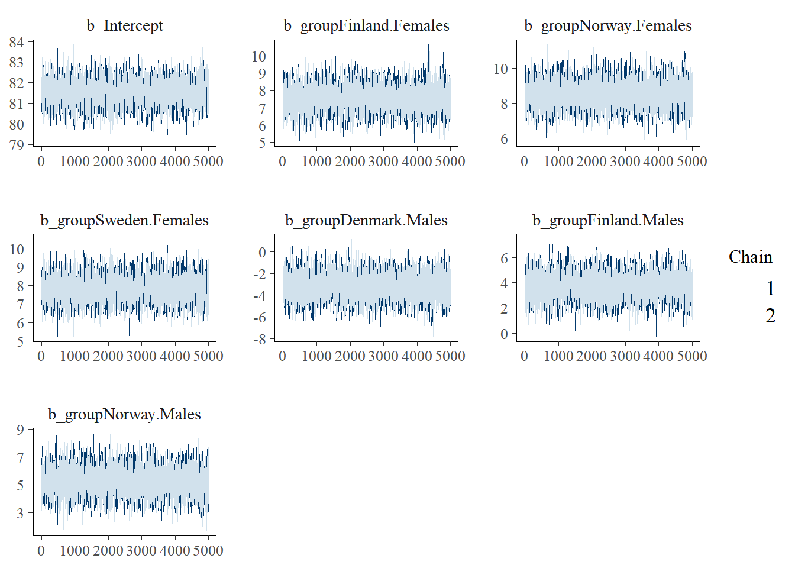

This page shows R code for the study [Tichanek et al.](https://www.mdpi.com/1422-0067/24/13/10689) (2023, *European Journal of Endocrinology*).

**Citation**:

> WILL BE ADDED

[GitHub page](https://github.com/filip-tichanek/edaravonSCA1): https://github.com/filip-tichanek/nord_thyroid

# Upload of packages


::: {.cell}

```{.r .cell-code}
rm(list = ls())

suppressWarnings(suppressMessages( {
  library(brms)
  library(stringr)
  library(dplyr)
  library(bayesplot)
  library(knitr)
  } ) )
```
:::


# Defining custom functions

## *run_model*

Function to run and save, or load, Bayesian model. The function was written according to online proposal of Paul-Christian Bürkner. Arguments are:

-   *expr*: model formula
-   *path*: path, including name of model
-   *reuse*: indicates whether to take already existing mode with the same path (if it exists)


::: {.cell}

```{.r .cell-code}
    run_model <- function(expr, path, reuse = TRUE) {
      path <- paste0(path, ".Rds")
      if (reuse) {
        fit <- suppressWarnings(try(readRDS(path), silent = TRUE))
        }
      if (is(fit, "try-error")) {
        fit <- eval(expr)
        saveRDS(fit, file = path)
        }
      fit
    }
```
:::


## Functions for plotting the non-linear survival trends

All the functions below serve for plotting of nonlinear trends in survival and related uncertainty. All the functions below use extracted posterior samples as an input **data**. The samples represent estimation of survival over the 50 years (1971 to 2020) for specific country and type of survival (1-year, 5-years, conditional \[5y/1y\]. The time period of 50 years must be divided to sequence of 500 numbers (1/10 of a year).

### *breakpo*

This function serves to identify ***breaking points***, i.e. times when the annual change of survival changed with at least 95% plausibility. This was assessed by calculation of the 2nd derivation of the given survival measure and its 95% credible interval (CI); the '*breaking point*' was defined as a peak value within at least a 3-year interval where 95% CI for the 2nd derivation did not cross zero.

If the 2nd derivation is plausibly non-zero for at least 3 years, the function takes the peak in the 2nd derivation (within the identified time interval) as the *breaking point* (must be between the years 1976 and 2016).

Function also returns table of potential *breaking points*, if they were identified.

There is one additional argument *arb* which should be zero except for the situation when the multiple breaking points overlap. The argument only move the breaking points by given value to avoid overlapping.


::: {.cell}

```{.r .cell-code}
breakpo <- function(data, arb){ 
 
  data <- data.frame((data[,-1] - data[,-ncol(data)])*10)
  data <- data.frame(data[,-1] - data[,-ncol(data)])
  data = sapply(data, function(p) quantile(p, probs = c(0.025,0.975,0.5)))
  
  cbinl <- c()
  x=1
  repeat{
    cbinl[x] <- if(
      data[1,x]>0|data[2,x]<0){cbinl[x]=1
    } else{cbinl[x]=0
    }
    
    x = x+1
    if(x>length(data[1,])){break}}
  
  cbin=1
  x=1
  repeat{
    cbin[x+1]<-abs(cbinl[x]-cbinl[x+1])
    x=x+1
    if(x>(length(cbinl)-1)){break}}
  
  data <- data.frame(rbind(data,cbin));data[5,]<-yreal[c(2:499)]-0.049
  data[6,] <- 1:498
  data[4,51] = 1
  data[4,449] = 1
  
  row.names(data)<-c("cil", "ciu", "est", "stat_change", "year", "timepoint")
  data2 = t(data[,data[4,]==1])
  data2 <- data.frame(data2)
  tr <- subset(data2, 
               data2$timepoint>50 & 
               data2$timepoint<450)
  y = 1
  bp = c()
  bx = 1
  repeat{
    if( (tr[y,1]<0) & (tr[y,2]<0) & (  (tr$year[y+1]-tr$year[y])>3   )  ) {
      tr2 <- data[,tr[y,6]:(tr[y+1,6]-2)]
      bp[bx] <- tr2[,order(tr2[3,], decreasing=F)[1]][5]
      bx = bx+1
    }
    if( (tr[y,1]>0) & (tr[y,2]>0) & (  (tr$year[y+1]-tr$year[y])>3   )) {
      tr2 <- data[,tr[y,6]:(tr[y+1,6]-2)]
      bp[bx] <- tr2[,order(tr2[3,], decreasing=T)[1]][5]
      bx = bx+1
    }
    
    y = y+1
    if(y>(dim(tr)[1]-1)){break}}
  
  y <- 1
  
  try(repeat{
    lines(c(bp[y]+arb,bp[y]+ arb),
          c(range[1],range[1]+0.025*scal),col=cola[xx], lwd=3.5,lend=1)
    lines(c(bp[y]+arb,bp[y]+ arb),
          c(range[2],range[2]-0.025*scal),col=cola[xx], lwd=3.5,lend=1)
    lines(c(bp[y]+arb,bp[y]+ arb),
          c(range[1],range[1]+0.999*scal),col=colc[xx], lwd=1,lend=1, lty=2)
    
    y = y+1
    if(y>length(bp)){break}}, silent=TRUE)
  
 print(bp)
 print(tr)
 
 }
```
:::


### *polyg_surv*

for drawing 95% credible interval for survival indicators


::: {.cell}

```{.r .cell-code}
polyg_surv <- function(data){ 
  data <- data.frame(data)
  data <- sapply(data, 
                 function(p) quantile(p, probs = c(0.025,0.975,0.5))
                 )
  cis <- c(data[1,],rev(data[2,]))
  x <- c(yreal[1:500],yreal[500:1])
  cis[cis<range[1]] < -range[1]
  cis[cis>range[2]] <- range[2]
  polygon(x, cis, border=NA, col=colb[xx], xpd=F)}
```
:::


### *surv_fit*

Fit curve of survival trend over the 50 years. **Solid lines** imply that that the curve is increasing or decreasing with at least 95% plausibility (95% credible interval for 1st derivation of estimated survival does not cross zero) for at least 5 years. Dashed lines show otherwise (no detectable change in the survival)


::: {.cell}

```{.r .cell-code}
surv_fit <- function(data){
  data = data.frame(data)
  cis = data.frame((data[,-1] - data[,- ncol(data)])*10)
  cis =sapply(cis, function(p) quantile(p, probs = c(0.025,0.975)))
  est=sapply(data, function(p) quantile(p, probs = c(0.5)))
  dat35 = cis
  cbinl = c()
  x = 1
  repeat{
    cbinl[x] <- if(dat35[1,x]>0|dat35[2,x]<0){
      cbinl[x]=1} else{cbinl[x]=0
      }
    x = x+1
    if(x>length(dat35[1,])){break}
    }
  cbin = 1
  x = 1
  repeat{
    cbin[x+1] <- abs(cbinl[x]-cbinl[x+1])
    x=x+1
    if(x > (length(cbinl)-1)){break}
    }
  dat35 <- data.frame(rbind(dat35, cbin))
  dat35[4,] <- yreal[c(2:500)]-0.049
  dat35[5,] <- 1:499
  row.names(dat35) <- c("cil","ciu","stat_change","year","timepoint")
  dat35[3, 499] = 1
  dat352 = t(dat35[,dat35[3,]==1])
  dat352 <- data.frame(dat352)
  tr <- dat352
  y=1
  yreal = seq(1971, 2020, length=500)
  repeat{
    if((((tr[y,1]<0)&
         (tr[y,2])<0))|
       (((tr[y,1]>0)&
         (tr[y,2])>0))&
       (tr[y+1,4]-tr[y,4])>5)
    {lines(yreal[tr[y,5]:tr[y+1,5]],
           est[tr[y,5]:tr[y+1,5]],
           lwd=1.9, col=cola[xx],lend=1)}
    
    y <- y+1
    if(y>dim(tr)[1]-1){break}}
  
  lines(yreal[1:500], est, lwd=1, col=cola[xx],lty=2, lend=1)}
```
:::


### *polyg_slope*

Draws 95% credible interval for slope of the survival trend (1st derivation of the estimated survival trend)


::: {.cell}

```{.r .cell-code}
polyg_slope <- function(data){ 
  x <- c(yreal[1:499],yreal[499:1])
  data <- data.frame((data[,-1] - data[,-ncol(data)]))*10
  data = sapply(data, 
                function(p) quantile(p, probs = c(0.025,0.975,0.5)))
  cis <- c(data[1,],rev(data[2,]))
  cis[cis<range[1]] <- range[1]
  cis[cis>range[2]] <- range[2]
  polygon(x, cis, border=NA, col=colb[xx])}
```
:::


### *slope_fit*

Fit curve of **slope** (i.e., the **magnitude of the change**) of the survival trend over the 50 years. Solid lines imply that that the curve is increasing or decreasing with at least 95% plausibility (95% credible interval for 2st derivation of estimated survival does not cross zero) for at least 3 years. Dashed lines show otherwise (no detectable change in the slope of the survival trend)


::: {.cell}

```{.r .cell-code}
slope_fit<-function(data){
  data = data.frame((data[,-1] - data[,-ncol(data)])*10)
  dar2 <- sapply(data, function(p) quantile(p, probs = c(0.5)))
  data <- data.frame(data[,-1] - data[,-ncol(data)])
  data = sapply(data, function(p) quantile(p, probs = c(0.025,0.975,0.5)))
  
  cbinl <- c()
  x=1
  
  repeat{
    cbinl[x] <- if(
      data[1,x]>0|data[2,x]<0){
      cbinl[x]=1}else{cbinl[x]=0
      }
    
    x <- x+1
    if(x>length(data[1,])){break}}
  
  cbin = 1
  x = 1
  repeat{
    cbin[x+1] <- abs(cbinl[x]-cbinl[x+1])
    x = x + 1
    if(x>(length(cbinl)-1)){break}}
  
  data <- data.frame(rbind(data,cbin))
  data[5,] <- yreal[c(2:499)]-0.049
  data[6,] <- 1:498
  
  row.names(data) <- c("cil","ciu","est","stat_change","year","timepoint")
  data[4,450] <- 1
  data[4,50] <- 1
  
  data = data[,50:450]
  lines(yreal[1:499], dar2, lwd=1, col=cola[xx],lty=2,lend=1)
  data2 = (t(data[,data[4,]==1]))
  
  data2 <- data.frame(data2)
  tr <- data2
  y = 1
  yreal = seq(1971, 2020, length=498)
  repeat{
    if(((((tr[y,1]<0)&
          (tr[y,2])<0))|
        (((tr[y,1]>0)&
          (tr[y,2])>0)))&
       (tr[y+1,5]-tr[y,5])>3)
    {lines(yreal[tr[y,6]:tr[y+1,6]],
           dar2[tr[y,6]:tr[y+1,6]],
           lwd=1.9, col=cola[xx], lend=1)
      }
    y <- y+1
    if(y>dim(tr)[1]-1){break}}
  }
```
:::


# Incidence and mortality

## Data upload and wrangling


::: {.cell}

```{.r .cell-code}
# setting parameters for smoothing
spar = 0.3
knot = 12

# colors ---------------------------------------------------------

cola <- c(
  rgb(1, 0.1, 0.1, alpha = 1),
  rgb(0.1, 0.1, 1, alpha = 1),
  rgb(0, 0.6, 0.3, alpha = 1),
  rgb(0.7, 0.7, 0.1, alpha = 1))

colb<-c(
  rgb(1, 0.1, 0.1, alpha = 0.2),
  rgb(0.1, 0.1, 1, alpha = 0.2),
  rgb(0, 0.6, 0.3, alpha = 0.2),
  rgb(0.7, 0.7, 0.1, alpha = 0.2))

colc<-c(
  rgb(1, 0.1, 0.1, alpha = 0.8),
  rgb(0.1, 0.1, 1, alpha = 0.8),
  rgb(0, 0.6, 0.3, alpha = 0.8),
  rgb(0.7, 0.7, 0.1, alpha = 0.8))


# thyroid data
thyroid_inc_mor <- read.csv("source_data/inc_mor_thyroid.csv",sep=",")
colnam <- thyroid_inc_mor[,1]

thyroid_inc_mor <- data.frame(t(thyroid_inc_mor))[-1, ]
colnames(thyroid_inc_mor) <- colnam
thyroid_inc_mor$year <- 1943:2020

### Subseting years 1961-2020
thyroid_inc_mor <- thyroid_inc_mor[thyroid_inc_mor$year > 1960, ]
thyroid_inc_mor[1:4, 1:4]
```

::: {.cell-output .cell-output-stdout}
```
      Denmark, incidence, males Finland, incidence, males
X1961                      0.75                      1.10
X1962                      0.71                      1.10
X1963                      0.51                      1.00
X1964                      0.49                      1.20
      Norway, incidence, males Sweden, incidence, males
X1961                     0.64                     1.20
X1962                     1.20                     1.40
X1963                     1.00                     1.30
X1964                     0.99                     1.30
```
:::

```{.r .cell-code}
### Removing space character and converting characters to numbers
for(x in 1:dim(thyroid_inc_mor)[2]){
thyroid_inc_mor[,x] <- str_trim(thyroid_inc_mor[,x])
thyroid_inc_mor[,x] <- as.numeric(thyroid_inc_mor[,x]) }
summary(thyroid_inc_mor) 
```

::: {.cell-output .cell-output-stdout}
```
 Denmark, incidence, males Finland, incidence, males Norway, incidence, males
 Min.   :0.4900            Min.   :0.540             Min.   :0.640           
 1st Qu.:0.8575            1st Qu.:1.400             1st Qu.:1.400           
 Median :1.1000            Median :2.000             Median :1.650           
 Mean   :1.2818            Mean   :2.055             Mean   :1.822           
 3rd Qu.:1.4000            3rd Qu.:2.500             3rd Qu.:2.100           
 Max.   :3.4000            Max.   :3.900             Max.   :3.500           
 Sweden, incidence, males Denmark, incidence, females
 Min.   :1.00             Min.   :1.300              
 1st Qu.:1.30             1st Qu.:1.900              
 Median :1.50             Median :2.250              
 Mean   :1.58             Mean   :3.080              
 3rd Qu.:1.80             3rd Qu.:3.425              
 Max.   :2.40             Max.   :9.100              
 Finland, incidence, females Norway, incidence, females
 Min.   : 1.900              Min.   : 2.000            
 1st Qu.: 4.550              1st Qu.: 4.075            
 Median : 6.350              Median : 4.700            
 Mean   : 6.243              Mean   : 5.032            
 3rd Qu.: 7.925              3rd Qu.: 5.450            
 Max.   :11.000              Max.   :10.700            
 Sweden, incidence, females Denmark, mortality, males Finland, mortality, males
 Min.   :2.900              Min.   :0.1300            Min.   :0.2100           
 1st Qu.:3.375              1st Qu.:0.2700            1st Qu.:0.3575           
 Median :3.900              Median :0.3600            Median :0.4650           
 Mean   :4.193              Mean   :0.3785            Mean   :0.4722           
 3rd Qu.:4.400              3rd Qu.:0.4700            3rd Qu.:0.5500           
 Max.   :7.300              Max.   :0.7000            Max.   :0.9800           
 Norway, mortality, males Sweden, mortality, males Denmark, mortality, females
 Min.   :0.1000           Min.   :0.1900           Min.   :0.1300             
 1st Qu.:0.2700           1st Qu.:0.2900           1st Qu.:0.3200             
 Median :0.3400           Median :0.3550           Median :0.4700             
 Mean   :0.3757           Mean   :0.4032           Mean   :0.5310             
 3rd Qu.:0.4700           3rd Qu.:0.5225           3rd Qu.:0.6725             
 Max.   :0.8700           Max.   :0.7400           Max.   :1.1000             
 Finland, mortality, females Norway, mortality, females
 Min.   :0.2200              Min.   :0.1800            
 1st Qu.:0.3675              1st Qu.:0.3525            
 Median :0.6200              Median :0.4750            
 Mean   :0.6613              Mean   :0.5068            
 3rd Qu.:0.8925              3rd Qu.:0.6500            
 Max.   :1.4000              Max.   :1.1000            
 Sweden, mortality, females      year     
 Min.   :0.2100             Min.   :1961  
 1st Qu.:0.3100             1st Qu.:1976  
 Median :0.4550             Median :1990  
 Mean   :0.5325             Mean   :1990  
 3rd Qu.:0.7125             3rd Qu.:2005  
 Max.   :1.2000             Max.   :2020  
```
:::
:::


## Incidence and mortaility plotting


::: {.cell}

```{.r .cell-code}
## General setting and titles of plots

m <- matrix(c(9 ,1, 2,
              3 ,5, 6,
              4, 7, 8), nrow = 3, ncol =3 ,byrow = TRUE)
layout(mat = m,heights = c(0.04,0.96/2,0.96/2),
       widths = c(0.08,0.95/2,0.95/2))
par(mgp=c(1.6,0.8,0))
par(mar=c(0,0,0,0))

plot(NULL, axes=FALSE,xlab="",ylab="",xlim=c(-1,1),ylim=c(-0.85,0.85))
text(0.05,-0.,"Males",cex=1.8,font=3,xpd=TRUE)

plot(NULL, axes=FALSE,xlab="",ylab="",xlim=c(-1,1),ylim=c(-0.85,0.85))
text(0.05,-0.,"Females",cex=1.8,font=3,xpd=TRUE)

par(mar=c(1.8,0,0,0))
plot(NULL, axes=FALSE,xlab="",ylab="",xlim=c(-1,1),ylim=c(-0.85,0.85))
text(-0.5,0,"Incidence per 100,000 (ASR - World)",cex=1.4,xpd=TRUE,srt=90)

plot(NULL, axes=FALSE,xlab="",ylab="",xlim=c(-1,1),ylim=c(-0.85,0.85))
text(-0.5,0,"Mortality per 100,000 (ASR - World)",cex=1.4,xpd=TRUE,srt=90)


## Plot of thyroid cancer ----------------
par(mgp=c(0.1,0.8,0))
par(mar=c(2,0,0,0))

range<-c(0,12);scal<-range[2]-range[1]
xrange<-c(1961,2020)

plot(NULL,xlim=xrange,ylim=c(range[1],range[2]),xlab="",ylab=""
     ,las=1, axes=FALSE)
rect(xrange[1],range[2],xrange[2],range[1],col="grey90",border=NA)

x = range[1]
repeat{
  lines(c(xrange[1],xrange[2]),c(x,x),col="white")
  x=x+2;if(x>range[2]){break}}

x<- round(xrange[1]+5,-1)
repeat{
  lines(c(x,x),c(range[1],range[2]),col="white")
  x=x+10;if(x>2020){break}}

data = thyroid_inc_mor

for (xx in 1:4){
  smoothingSpline = smooth.spline(data$year, data[,xx], spar=spar, nknots=knot)
  lines(smoothingSpline,col=colc[xx],lty=1,lwd=2,lend=1)
}


axis(2,las=2,cex.axis=1.4, at = seq(range[1], range[2], by=2)
        , pos = xrange[1], tck = -0.02)
axis(2,las = 2, cex.axis = 1.4, at = c(range[1], range[2]), pos=xrange[1], tck = -0.025)

axis(side=1,las=1, cex.axis=1.4, 
     at = c(seq(round(xrange[1] + 5, -1), 2020, by=10)), pos=range[1], tck= -0.02, 
     labels = c(rep("", length((seq(round(xrange[1]+5,-1),2020,by=10))
       ) ) )
     )

axis(side=1, las=1, cex.axis=1.4,
     at = c(seq(round(xrange[1]+5,-1), 2020, by = 20)), pos = range[1],
     tck= -0.02)


lines(c(xrange[1], xrange[2]), c(range[1], range[1]))
text(1964, range[2]-0.05*scal, "a", cex = 2.5)

xx=1;yy=range[1]+scal*0.75
rect(2000,yy+0.035*scal,2019,yy-0.21*scal,col="white",border="grey50",lwd=0.8)
repeat{
  lines(c(2001,2004),c(yy,yy),lwd=12,col=cola[xx],lend=1)
  xx<-xx+1;yy=yy-(scal*0.058);if(xx>4){break}}

xx = 1;
yy = range[1] + scal*0.75
text(2011.5,yy,"Denmark",col=cola[xx],cex=1.25);xx=xx+1;yy=yy-(scal*0.058)
text(2011.5,yy,"Finland",col=cola[xx],cex=1.25);xx=xx+1;yy=yy-(scal*0.058)
text(2011.5,yy,"Norway",col=cola[xx],cex=1.25);xx=xx+1;yy=yy-(scal*0.058)
text(2011.4,yy,"Sweden",col=cola[xx],cex=1.25);xx=xx+1;yy=yy-(scal*0.058)

# females
plot(NULL,xlim=xrange,ylim=c(range[1],range[2]),xlab="",ylab=""
     ,las=1, axes=FALSE)
rect(xrange[1],range[2],xrange[2],range[1],col="grey90",border=NA)

x<-range[1]
repeat{
  lines(c(xrange[1],xrange[2]),c(x,x),col="white")
  x=x+2;if(x>range[2]){break}}

x<- round(xrange[1]+5,-1)
repeat{
  lines(c(x,x),c(range[1],range[2]),col="white")
  x=x+10;if(x>2020){break}}

for(xx in 5:8){
  smoothingSpline = smooth.spline(data$year, data[,xx], spar=spar, nknots=knot)
  lines(smoothingSpline, col=colc[xx-4],lty=1, lwd=2, lend=1)
  }

axis(2,las=2,cex.axis=1.4,at=seq(range[1],range[2],by=2)
     ,pos=xrange[1],tck= -0.02, labels=c(rep("",length(seq(range[1],range[2],by=2)) )) )

axis(side=1,las=1,cex.axis=1.4,at=c(seq(round(xrange[1]+5,-1),2020,by=10)),pos=range[1],
     tck= -0.02,labels=c(rep("",length((seq(round(xrange[1]+5,-1),2020,by=10))))))

axis(side=1,las=1,cex.axis=1.4,at=c(seq(round(xrange[1]+5,-1),2020,by=20)),pos=range[1],
     tck= -0.02)
lines(c(xrange[1],xrange[2]),c(range[1],range[1]))
text(1964,range[2]-0.05*scal,"b",cex=2.5)


# mortality males
range = c(0,1.5)
scal = range[2]-range[1]
xrange = c(1961, 2020)

plot(NULL,xlim=xrange,ylim=c(range[1],range[2]),xlab="",ylab=""
     ,las=1, axes=FALSE)
rect(xrange[1],range[2],xrange[2],range[1],col="grey90",border=NA)
x = range[1]
repeat{
  lines(c(xrange[1],xrange[2]),c(x,x),col="white")
  x = x+0.5
  if(x>range[2]){break}}

x<- round(xrange[1]+5,-1)
repeat{
  lines(c(x,x),c(range[1],range[2]),col="white")
  x=x+10;if(x>2020){break}}


for(xx in 9:12){
  smoothingSpline = smooth.spline(data$year, data[,xx], spar=spar, nknots=knot)
  lines(smoothingSpline,col=colc[xx-8],lty=1,lwd=2,lend=1)
  }

axis(2,las=2,cex.axis=1.4,at=seq(range[1],range[2],by=0.5)
     ,pos=xrange[1],tck= -0.02 )

axis(side=1,las=1,cex.axis=1.4,at=c(seq(round(xrange[1]+5,-1),2020,by=10)),pos=range[1],
     tck= -0.02,labels=c(rep("",length((seq(round(xrange[1]+5,-1),2020,by=10))))))

axis(side=1,las=1,cex.axis=1.4,at=c(seq(round(xrange[1]+5,-1),2020,by=20)),pos=range[1],
     tck= -0.02)
lines(c(xrange[1],xrange[2]),c(range[1],range[1]))
text(1964,range[2]-0.05*scal,"c",cex=2.5)


# mortality females
plot(NULL,xlim=xrange,ylim=c(range[1],range[2]),xlab="",ylab=""
     ,las=1, axes=FALSE)

rect(xrange[1],range[2],xrange[2],range[1],col="grey90",border=NA)
x = range[1]

repeat{
  lines(c(xrange[1],xrange[2]),c(x,x),col="white")
  x=x+0.5;if(x>range[2]){break}}

x<- round(xrange[1]+5,-1)
repeat{
  lines(c(x,x),c(range[1],range[2]),col="white")
  x=x+10
  if(x>2020){break}}

for(xx in 12:16){
  smoothingSpline = smooth.spline(data$year, data[,xx], spar=spar, nknots=knot)
  lines(smoothingSpline,col=colc[xx-12],lty=1,lwd=2,lend=1)
  }

axis(2,las=2,cex.axis=1.4,at=seq(range[1],range[2],by=0.5)
     ,pos=xrange[1],tck= -0.02, labels=c(rep("",length(seq(range[1],range[2],by=0.5)) )) )

axis(side=1,las=1,cex.axis=1.4,at=c(seq(round(xrange[1]+5,-1),2020,by=10)),pos=range[1],
     tck= -0.02,labels=c(rep("",length((seq(round(xrange[1]+5,-1),2020,by=10))))))

axis(side=1,las=1,cex.axis=1.4,at=c(seq(round(xrange[1]+5,-1),2020,by=20)),pos=range[1],
     tck= -0.02)
lines(c(xrange[1],xrange[2]),c(range[1],range[1]))
text(1964,range[2]-0.05*scal,"d",cex=2.5)
```

::: {.cell-output-display}
{width=547.2}
:::
:::


# Survival trends

This code aim to time trends in the thyroid cancers using Bayesian Generalized Additive Models. Data were downloaded from [NORDCAN](https://nordcan.iarc.fr/en) website.


::: {.cell}

```{.r .cell-code}
cola<-c(
  rgb(1, 0, 0, alpha=1),
  rgb(0.2,0.2,1,alpha=1),
  rgb(0, 0.7, 0,alpha=1),
  rgb(0.7,0.7,0.1,alpha=1))

alp=0.18;colb<-c(
  rgb(1, 0, 0, alpha=alp),
  rgb(0.2, 0.2, 1, alpha=alp),
  rgb(0, 0.9, 0,alpha=alp),
  rgb(0.7,0.7,0.1,alpha=alp))

colc<-c(
  rgb(1,0,0,alpha=0.8),
  rgb(0.2,0.2,1,alpha=0.8),
  rgb(0, 0.9, 0,alpha=0.8),
  rgb(0.7,0.7,0.1,alpha=0.8))
```
:::


### Data upload


::: {.cell}

```{.r .cell-code}
thyroid_1y <- read.csv("source_data/thyroid_1y.csv", sep=";")
thyroid_5y <- read.csv("source_data/thyroid_5y.csv", sep=";")
```
:::


### Data wrangling


::: {.cell}

```{.r .cell-code}
thyroid_1y_est <- data.frame(thyroid_1y[, 1])
for (x in 2:9){
  thyroid_1y_est[,x] <- str_sub(thyroid_1y[, x], 1, 4) }

for (x in 10:17){
  thyroid_1y_est[,x] <- str_sub(thyroid_1y[, x-8], 6, 9) }

thyroid_5y_est <- data.frame(thyroid_5y[,1])
for (x in 2:9){thyroid_5y_est[,x]  <-  str_sub(thyroid_5y[,x], 1, 4) }
for (x in 10:17){thyroid_5y_est[,x]  <-  str_sub(thyroid_5y[,x-8], 6, 9) }

thyroid <- (data.frame(unlist(thyroid_1y_est[,2:9])));colnames(thyroid) <- "surv_1y"
thyroid$cil_1y <- as.numeric(unlist(thyroid_1y_est[,10:17]))
thyroid$surv_5y <- as.numeric(unlist(thyroid_5y_est[,2:9]))
thyroid$cil_5y <- as.numeric(unlist(thyroid_5y_est[,10:17]))
thyroid$year <- rep(seq(1973,2018,by=5),8)
thyroid$sex <- c(rep("Males",40),rep("Females",40))
thyroid$country <- c(rep(c(rep("Denmark",10), rep("Finland",10), rep("Norway",10),
                        rep("Sweden",10)),2))
thyroid$shou <- c(rep(c(rep("den_mal_",10), rep("fin_mal_",10), rep("nor_mal_",10),
                     rep("swe_mal_",10), rep("den_fem_",10), rep("fin_fem_",10),
                     rep("nor_fem_",10), rep("swe_fem_",10)),1))
thyroid$group <- interaction(thyroid$country,thyroid$sex)
thyroid$years10cen <- (thyroid$year-1995.5)/10
thyroid$surv_1y <- as.numeric(thyroid$surv_1y)
thyroid$surv_5y <- as.numeric(thyroid$surv_5y)
thyroid$cil_1y <- as.numeric(thyroid$cil_1y)
thyroid$cil_5y <- as.numeric(thyroid$cil_5y)
thyroid$se_1y <- (thyroid$surv_1y-thyroid$cil_1y)/1.96
thyroid$se_5y <- (thyroid$surv_5y-thyroid$cil_5y)/1.96
thyroid$surv_cond <- (thyroid$surv_5y/thyroid$surv_1y)*100
summary(thyroid)
```

::: {.cell-output .cell-output-stdout}
```
    surv_1y          cil_1y         surv_5y          cil_5y           year     
 Min.   :59.40   Min.   :51.90   Min.   :45.90   Min.   :37.90   Min.   :1973  
 1st Qu.:82.17   1st Qu.:77.40   1st Qu.:74.12   1st Qu.:67.47   1st Qu.:1983  
 Median :87.10   Median :84.45   Median :81.90   Median :77.40   Median :1996  
 Mean   :85.56   Mean   :82.08   Mean   :79.47   Mean   :74.87   Mean   :1996  
 3rd Qu.:91.65   3rd Qu.:89.33   3rd Qu.:86.90   3rd Qu.:83.62   3rd Qu.:2008  
 Max.   :96.00   Max.   :94.90   Max.   :95.40   Max.   :93.80   Max.   :2018  
                                                                               
     sex              country              shou                       group   
 Length:80          Length:80          Length:80          Denmark.Females:10  
 Class :character   Class :character   Class :character   Finland.Females:10  
 Mode  :character   Mode  :character   Mode  :character   Norway.Females :10  
                                                          Sweden.Females :10  
                                                          Denmark.Males  :10  
                                                          Finland.Males  :10  
                                                          (Other)        :20  
   years10cen        se_1y            se_5y          surv_cond    
 Min.   :-2.25   Min.   :0.5612   Min.   :0.8163   Min.   :77.27  
 1st Qu.:-1.25   1st Qu.:1.0587   1st Qu.:1.4286   1st Qu.:90.22  
 Median : 0.00   Median :1.5306   Median :2.1939   Median :93.23  
 Mean   : 0.00   Mean   :1.7800   Mean   :2.3508   Mean   :92.52  
 3rd Qu.: 1.25   3rd Qu.:2.3597   3rd Qu.:3.0102   3rd Qu.:96.01  
 Max.   : 2.25   Max.   :3.8776   Max.   :4.5408   Max.   :99.89  
                                                                  
```
:::
:::


## Modelling of survival trends

### Prior probabilities specification


::: {.cell}

```{.r .cell-code}
prior_group <- c(
set_prior("normal(0,30)", class = "b", coef = "groupFinland.Males"),
set_prior("normal(0,30)", class = "b", coef = "groupNorway.Males"),
set_prior("normal(0,30)", class = "b", coef = "groupSweden.Males"),
set_prior("normal(0,30)", class = "b", coef = "groupDenmark.Males"),
set_prior("normal(0,30)", class = "b", coef = "groupNorway.Females"),
set_prior("normal(0,30)", class = "b", coef = "groupFinland.Females"),
set_prior("normal(0,30)", class = "b", coef = "groupSweden.Females"))
```
:::


### Fitting models of thyroid survival


::: {.cell}

```{.r .cell-code}
thyroid_1y_model <- run_model(
  brm(surv_1y|se(se_1y) ~ group + s(years10cen, by=group, k=5),
      family="Gaussian", 
      prior = prior_group,
      data = thyroid, seed = 17,
      iter = 7000, warmup = 2000, chains = 2, cores = 1,
      control = list(adapt_delta = 0.98),
      save_pars = save_pars(all = TRUE)),
  'brm/thyroid_1y_model', reuse = TRUE)

thyroid_5y_model <- run_model(
  brm(surv_5y|se(se_5y) ~ group + s(years10cen, by=group, k=5),
      family="Gaussian", 
      prior = prior_group,
      data = thyroid, seed = 17,
      iter = 7000, warmup = 2000, chains = 2, cores = 1,
      control = list(adapt_delta = 0.98),
      save_pars = save_pars(all = TRUE)),
  'brm/thyroid_5y_model', reuse = TRUE)
```
:::


### Diagnostics

Checking effective sample size of posterior samples, convergence of the models and posterior predictive check (PPC)

In general, diagnostics uses:

-   

    (i) *trace plot*: shows how well are chains of posterior sampling mixed, whether they are issues with convergence and related autocorrelation of samples. We will show the trace plot for only few parameters (intercept + group effect)

-   

    (ii) *summary(model)*: the columns of intereste are ***Rhat*** (when = 1, model converged well), and columns ***Tail_ESS*** and ***Bulk_ESS*** which should never go under 1,000 and should be mostly above 2,000.

-   

    (iii) ***pp_check*** : graphical tools to explore how well the model predicts real data, as thoroughly described by Gelman [here](http://www.stat.columbia.edu/~gelman/book/). Ideally, there should not be strong discrepancy between the model prediction and the distribution of the real dataset.

You can use also *plot(model)* to see convergence of chains and to explore posterior distribution of parameters, estimated via the models

Finally, we will also use a function *prior_summary* to explore the prior probabilities set

Thyroid 1y model


::: {.cell}

```{.r .cell-code}
## MCMC trace plot
mcmc_trace(thyroid_1y_model, pars = c(
  'b_Intercept',
  'b_groupFinland.Females',
  'b_groupNorway.Females',
  'b_groupNorway.Females' ,
  'b_groupSweden.Females',
  'b_groupDenmark.Males',
  'b_groupFinland.Males',
  'b_groupNorway.Males',
  'b_groupNorway.Males'))
```

::: {.cell-output-display}
{width=672}
:::

```{.r .cell-code}
## model summary
summary(thyroid_1y_model)
```

::: {.cell-output .cell-output-stdout}
```
 Family: gaussian 
  Links: mu = identity; sigma = identity 
Formula: surv_1y | se(se_1y) ~ group + s(years10cen, by = group, k = 5) 
   Data: thyroid (Number of observations: 80) 
  Draws: 2 chains, each with iter = 7000; warmup = 2000; thin = 1;
         total post-warmup draws = 10000

Smooth Terms: 
                                       Estimate Est.Error l-95% CI u-95% CI
sds(syears10cengroupDenmark.Females_1)     8.04      5.28     1.00    21.12
sds(syears10cengroupFinland.Females_1)     4.97      3.56     0.44    13.96
sds(syears10cengroupNorway.Females_1)      3.71      3.83     0.12    13.51
sds(syears10cengroupSweden.Females_1)      8.18      6.45     0.32    24.19
sds(syears10cengroupDenmark.Males_1)       5.38      4.63     0.20    16.88
sds(syears10cengroupFinland.Males_1)       9.68      6.53     0.90    26.03
sds(syears10cengroupNorway.Males_1)        5.42      4.94     0.20    18.00
sds(syears10cengroupSweden.Males_1)        8.46      4.95     1.37    20.58
                                       Rhat Bulk_ESS Tail_ESS
sds(syears10cengroupDenmark.Females_1) 1.00     4484     3325
sds(syears10cengroupFinland.Females_1) 1.00     4507     4470
sds(syears10cengroupNorway.Females_1)  1.00     4869     5362
sds(syears10cengroupSweden.Females_1)  1.00     2637     4254
sds(syears10cengroupDenmark.Males_1)   1.00     6361     4543
sds(syears10cengroupFinland.Males_1)   1.00     3508     2557
sds(syears10cengroupNorway.Males_1)    1.00     5327     4819
sds(syears10cengroupSweden.Males_1)    1.00     3751     2199

Population-Level Effects: 
                                   Estimate Est.Error l-95% CI u-95% CI Rhat
Intercept                             81.51      0.61    80.31    82.68 1.00
groupFinland.Females                   7.57      0.71     6.18     8.94 1.00
groupNorway.Females                    8.53      0.74     7.10     9.96 1.00
groupSweden.Females                    7.87      0.68     6.54     9.19 1.00
groupDenmark.Males                    -3.15      1.13    -5.41    -0.97 1.00
groupFinland.Males                     3.76      0.97     1.86     5.64 1.00
groupNorway.Males                      5.27      0.95     3.43     7.15 1.00
groupSweden.Males                      3.97      0.79     2.40     5.49 1.00
syears10cen:groupDenmark.Females_1    65.82     10.51    47.63    89.90 1.00
syears10cen:groupFinland.Females_1    33.48      6.51    22.41    48.71 1.00
syears10cen:groupNorway.Females_1     25.63      5.67    15.16    39.18 1.00
syears10cen:groupSweden.Females_1     35.02      9.18    21.40    54.71 1.00
syears10cen:groupDenmark.Males_1      70.29      9.33    51.85    90.78 1.00
syears10cen:groupFinland.Males_1      24.72     12.86    -5.16    47.25 1.00
syears10cen:groupNorway.Males_1       24.86      8.84     3.93    40.50 1.00
syears10cen:groupSweden.Males_1       40.15     10.27    22.32    63.36 1.00
                                   Bulk_ESS Tail_ESS
Intercept                              4026     5809
groupFinland.Females                   4632     6018
groupNorway.Females                    5045     7268
groupSweden.Females                    4497     6355
groupDenmark.Males                     7463     7796
groupFinland.Males                     6413     7551
groupNorway.Males                      6115     6154
groupSweden.Males                      5351     6534
syears10cen:groupDenmark.Females_1     5837     6024
syears10cen:groupFinland.Females_1     7302     6897
syears10cen:groupNorway.Females_1      6507     4987
syears10cen:groupSweden.Females_1      3442     6671
syears10cen:groupDenmark.Males_1       7384     6174
syears10cen:groupFinland.Males_1       6983     6953
syears10cen:groupNorway.Males_1        6792     5771
syears10cen:groupSweden.Males_1        7608     6581

Family Specific Parameters: 
      Estimate Est.Error l-95% CI u-95% CI Rhat Bulk_ESS Tail_ESS
sigma     0.00      0.00     0.00     0.00   NA       NA       NA

Draws were sampled using sampling(NUTS). For each parameter, Bulk_ESS
and Tail_ESS are effective sample size measures, and Rhat is the potential
scale reduction factor on split chains (at convergence, Rhat = 1).
```
:::

```{.r .cell-code}
## PPC
pp_check(thyroid_1y_model, type='dens_overlay', ndraws = 100)
```

::: {.cell-output-display}
{width=672}
:::

```{.r .cell-code}
pp_check(thyroid_1y_model, type='scatter_avg') 
```

::: {.cell-output-display}
{width=672}
:::

```{.r .cell-code}
pp_check(thyroid_1y_model, type="stat_2d", stat = c("max", "min"), ndraws=100)
```

::: {.cell-output-display}
{width=672}
:::

```{.r .cell-code}
pp_check(thyroid_1y_model, type="stat_2d", stat = c("mean", "sd"), ndraws=100)
```

::: {.cell-output-display}
{width=672}
:::

```{.r .cell-code}
## summary of priors
prior_summary(thyroid_1y_model)
```

::: {.cell-output .cell-output-stdout}
```
                 prior     class                               coef group resp
                (flat)         b                                              
          normal(0,30)         b                 groupDenmark.Males           
          normal(0,30)         b               groupFinland.Females           
          normal(0,30)         b                 groupFinland.Males           
          normal(0,30)         b                groupNorway.Females           
          normal(0,30)         b                  groupNorway.Males           
          normal(0,30)         b                groupSweden.Females           
          normal(0,30)         b                  groupSweden.Males           
                (flat)         b syears10cen:groupDenmark.Females_1           
                (flat)         b   syears10cen:groupDenmark.Males_1           
                (flat)         b syears10cen:groupFinland.Females_1           
                (flat)         b   syears10cen:groupFinland.Males_1           
                (flat)         b  syears10cen:groupNorway.Females_1           
                (flat)         b    syears10cen:groupNorway.Males_1           
                (flat)         b  syears10cen:groupSweden.Females_1           
                (flat)         b    syears10cen:groupSweden.Males_1           
 student_t(3, 87.1, 7) Intercept                                              
    student_t(3, 0, 7)       sds                                              
    student_t(3, 0, 7)       sds   s(years10cen, by = group, k = 5)           
 dpar nlpar lb ub       source
                       default
                          user
                          user
                          user
                          user
                          user
                          user
                          user
                  (vectorized)
                  (vectorized)
                  (vectorized)
                  (vectorized)
                  (vectorized)
                  (vectorized)
                  (vectorized)
                  (vectorized)
                       default
             0         default
             0    (vectorized)
```
:::
:::


Everything seems to be fine: For all parameters, *Rhat* = 1, *ESS* is above 2000 and PPC show relatively good correspondence between the predicted and the real data. Only scatter plot shows tendency smaller and smaller error with increasing fit, but this is a minor issue (may model with logit link, e.g. beta model, be useful for such data in future??)

Thyroid 5y model


::: {.cell}

```{.r .cell-code}
## MCMC trace plot
mcmc_trace(thyroid_5y_model, pars = c(
  'b_Intercept',
  'b_groupFinland.Females',
  'b_groupNorway.Females',
  'b_groupNorway.Females' ,
  'b_groupSweden.Females',
  'b_groupDenmark.Males',
  'b_groupFinland.Males',
  'b_groupNorway.Males',
  'b_groupNorway.Males'))
```

::: {.cell-output-display}
{width=672}
:::

```{.r .cell-code}
## model summary
summary(thyroid_5y_model)
```

::: {.cell-output .cell-output-stdout}
```
 Family: gaussian 
  Links: mu = identity; sigma = identity 
Formula: surv_5y | se(se_5y) ~ group + s(years10cen, by = group, k = 5) 
   Data: thyroid (Number of observations: 80) 
  Draws: 2 chains, each with iter = 7000; warmup = 2000; thin = 1;
         total post-warmup draws = 10000

Smooth Terms: 
                                       Estimate Est.Error l-95% CI u-95% CI
sds(syears10cengroupDenmark.Females_1)     7.38      6.64     0.27    24.74
sds(syears10cengroupFinland.Females_1)     8.98      5.57     2.03    22.36
sds(syears10cengroupNorway.Females_1)      7.65      6.49     0.34    24.39
sds(syears10cengroupSweden.Females_1)      6.93      5.85     0.29    21.89
sds(syears10cengroupDenmark.Males_1)       6.95      6.49     0.23    22.80
sds(syears10cengroupFinland.Males_1)       9.81      7.30     0.58    27.79
sds(syears10cengroupNorway.Males_1)        6.81      6.68     0.20    24.29
sds(syears10cengroupSweden.Males_1)        8.98      7.40     0.38    27.15
                                       Rhat Bulk_ESS Tail_ESS
sds(syears10cengroupDenmark.Females_1) 1.00     4084     4636
sds(syears10cengroupFinland.Females_1) 1.00     6183     4976
sds(syears10cengroupNorway.Females_1)  1.00     4172     5305
sds(syears10cengroupSweden.Females_1)  1.00     3746     4189
sds(syears10cengroupDenmark.Males_1)   1.00     6057     5132
sds(syears10cengroupFinland.Males_1)   1.00     4694     4489
sds(syears10cengroupNorway.Males_1)    1.00     5660     5480
sds(syears10cengroupSweden.Males_1)    1.00     3943     5165

Population-Level Effects: 
                                   Estimate Est.Error l-95% CI u-95% CI Rhat
Intercept                             75.41      0.75    73.93    76.87 1.00
groupFinland.Females                   9.51      0.88     7.76    11.22 1.00
groupNorway.Females                   11.49      0.92     9.70    13.32 1.00
groupSweden.Females                    9.52      0.85     7.90    11.20 1.00
groupDenmark.Males                    -7.15      1.42    -9.93    -4.38 1.00
groupFinland.Males                     2.14      1.26    -0.36     4.54 1.00
groupNorway.Males                      5.28      1.26     2.79     7.73 1.00
groupSweden.Males                      2.20      1.04     0.15     4.24 1.00
syears10cen:groupDenmark.Females_1    78.69     11.86    60.28   108.01 1.00
syears10cen:groupFinland.Females_1    50.03      9.26    31.67    69.15 1.00
syears10cen:groupNorway.Females_1     40.20     12.05    23.66    69.44 1.00
syears10cen:groupSweden.Females_1     40.58      8.91    27.61    61.68 1.00
syears10cen:groupDenmark.Males_1      88.84     12.09    64.48   115.09 1.00
syears10cen:groupFinland.Males_1      44.04     14.01    15.21    73.67 1.00
syears10cen:groupNorway.Males_1       30.01     11.99     3.55    53.40 1.00
syears10cen:groupSweden.Males_1       58.33     14.34    37.67    93.09 1.00
                                   Bulk_ESS Tail_ESS
Intercept                              4721     6198
groupFinland.Females                   4962     6691
groupNorway.Females                    5236     7227
groupSweden.Females                    4934     6842
groupDenmark.Males                     8450     7355
groupFinland.Males                     7508     7819
groupNorway.Males                      7873     7677
groupSweden.Males                      6646     7339
syears10cen:groupDenmark.Females_1     5681     5521
syears10cen:groupFinland.Females_1     8896     6642
syears10cen:groupNorway.Females_1      5338     7002
syears10cen:groupSweden.Females_1      5757     7423
syears10cen:groupDenmark.Males_1       7324     5541
syears10cen:groupFinland.Males_1       8233     6867
syears10cen:groupNorway.Males_1        7503     5879
syears10cen:groupSweden.Males_1        5385     6941

Family Specific Parameters: 
      Estimate Est.Error l-95% CI u-95% CI Rhat Bulk_ESS Tail_ESS
sigma     0.00      0.00     0.00     0.00   NA       NA       NA

Draws were sampled using sampling(NUTS). For each parameter, Bulk_ESS
and Tail_ESS are effective sample size measures, and Rhat is the potential
scale reduction factor on split chains (at convergence, Rhat = 1).
```
:::

```{.r .cell-code}
## PPC
pp_check(thyroid_5y_model, type='dens_overlay', ndraws = 100)
```

::: {.cell-output-display}
{width=672}
:::

```{.r .cell-code}
pp_check(thyroid_5y_model, type='scatter_avg') 
```

::: {.cell-output-display}
{width=672}
:::

```{.r .cell-code}
pp_check(thyroid_5y_model, type="stat_2d", stat = c("max", "min"), ndraws=100)
```

::: {.cell-output-display}
{width=672}
:::

```{.r .cell-code}
pp_check(thyroid_5y_model, type="stat_2d", stat = c("mean", "sd"), ndraws=100)
```

::: {.cell-output-display}
{width=672}
:::

```{.r .cell-code}
## summary of priors
prior_summary(thyroid_5y_model)
```

::: {.cell-output .cell-output-stdout}
```
                    prior     class                               coef group
                   (flat)         b                                         
             normal(0,30)         b                 groupDenmark.Males      
             normal(0,30)         b               groupFinland.Females      
             normal(0,30)         b                 groupFinland.Males      
             normal(0,30)         b                groupNorway.Females      
             normal(0,30)         b                  groupNorway.Males      
             normal(0,30)         b                groupSweden.Females      
             normal(0,30)         b                  groupSweden.Males      
                   (flat)         b syears10cen:groupDenmark.Females_1      
                   (flat)         b   syears10cen:groupDenmark.Males_1      
                   (flat)         b syears10cen:groupFinland.Females_1      
                   (flat)         b   syears10cen:groupFinland.Males_1      
                   (flat)         b  syears10cen:groupNorway.Females_1      
                   (flat)         b    syears10cen:groupNorway.Males_1      
                   (flat)         b  syears10cen:groupSweden.Females_1      
                   (flat)         b    syears10cen:groupSweden.Males_1      
 student_t(3, 81.9, 10.2) Intercept                                         
    student_t(3, 0, 10.2)       sds                                         
    student_t(3, 0, 10.2)       sds   s(years10cen, by = group, k = 5)      
 resp dpar nlpar lb ub       source
                            default
                               user
                               user
                               user
                               user
                               user
                               user
                               user
                       (vectorized)
                       (vectorized)
                       (vectorized)
                       (vectorized)
                       (vectorized)
                       (vectorized)
                       (vectorized)
                       (vectorized)
                            default
                  0         default
                  0    (vectorized)
```
:::
:::


Everything seem fine again

## Extraction of posterior samples

It will be used to visualize the predictions of the models jointly with showing uncertainty of model estimations


::: {.cell}

```{.r .cell-code}
## thyroid posterior extraction ---------------------------------------------------
yreal <- seq(1971,2020,length=500)
first <- expand.grid(years10cen = ((yreal-1995.5)/10),
                     group = c(
                      'Denmark.Females',
                      'Finland.Females',
                      'Norway.Females',
                      'Sweden.Females',
                      'Denmark.Males',
                      'Finland.Males',
                      'Norway.Males',
                      'Sweden.Males'
                      ),
                     y = 0)

ms_1y <- posterior_smooths(thyroid_1y_model,
                           smooth="s(years10cen,by=group,k=5)",
                           newdata = first)

post_fix <- as.data.frame(thyroid_1y_model, 
                          variable = c(
                            "b_Intercept",
                            "b_groupFinland.Females",
                            "b_groupNorway.Females", 
                            "b_groupSweden.Females",
                            "b_groupDenmark.Males",
                            "b_groupFinland.Males",
                            "b_groupNorway.Males",
                            "b_groupSweden.Males"))

fixef(thyroid_1y_model)
```

::: {.cell-output .cell-output-stdout}
```
                                    Estimate  Est.Error      Q2.5      Q97.5
Intercept                          81.510893  0.6053729 80.309635 82.6794934
groupFinland.Females                7.567925  0.7055924  6.184333  8.9407454
groupNorway.Females                 8.528041  0.7353537  7.101768  9.9589445
groupSweden.Females                 7.869881  0.6751582  6.538273  9.1868797
groupDenmark.Males                 -3.150714  1.1338298 -5.410166 -0.9733637
groupFinland.Males                  3.760019  0.9687117  1.862846  5.6441425
groupNorway.Males                   5.270561  0.9470497  3.433825  7.1543902
groupSweden.Males                   3.965876  0.7907684  2.399325  5.4917263
syears10cen:groupDenmark.Females_1 65.821066 10.5123373 47.625247 89.9049560
syears10cen:groupFinland.Females_1 33.479775  6.5093455 22.409944 48.7085159
syears10cen:groupNorway.Females_1  25.629567  5.6665105 15.162886 39.1836561
syears10cen:groupSweden.Females_1  35.020097  9.1773170 21.403780 54.7065859
syears10cen:groupDenmark.Males_1   70.294040  9.3269171 51.849329 90.7791492
syears10cen:groupFinland.Males_1   24.717026 12.8606035 -5.157609 47.2499980
syears10cen:groupNorway.Males_1    24.856033  8.8442020  3.930083 40.4989900
syears10cen:groupSweden.Males_1    40.151764 10.2682856 22.319230 63.3562808
```
:::

```{.r .cell-code}
post_thyroid_den_fem_1y<-ms_1y[,1:500]     +post_fix[,1]
post_thyroid_fin_fem_1y<-ms_1y[,501:1000]  +post_fix[,1]+post_fix[,2]
post_thyroid_nor_fem_1y<-ms_1y[,1001:1500] +post_fix[,1]+post_fix[,3]
post_thyroid_swe_fem_1y<-ms_1y[,1501:2000] +post_fix[,1]+post_fix[,4]
post_thyroid_den_mal_1y<-ms_1y[,2001:2500] +post_fix[,1]+post_fix[,5]
post_thyroid_fin_mal_1y<-ms_1y[,2501:3000] +post_fix[,1]+post_fix[,6]
post_thyroid_nor_mal_1y<-ms_1y[,3001:3500] +post_fix[,1]+post_fix[,7]
post_thyroid_swe_mal_1y<-ms_1y[,3501:4000] +post_fix[,1]+post_fix[,8]

post_fix<-as.data.frame(thyroid_5y_model, 
                        variable = c(
                          "b_Intercept",
                          "b_groupFinland.Females",                                     
                          "b_groupNorway.Females",
                          "b_groupSweden.Females",
                          "b_groupDenmark.Males",
                          "b_groupFinland.Males",
                          "b_groupNorway.Males",
                          "b_groupSweden.Males"))

ms_5y <- posterior_smooths(thyroid_5y_model,
                           smooth="s(years10cen,by=group,k=5)",
                           newdata = first)

post_thyroid_den_fem_5y<-ms_5y[,1:500]     +post_fix[,1]
post_thyroid_fin_fem_5y<-ms_5y[,501:1000]  +post_fix[,1]+post_fix[,2]
post_thyroid_nor_fem_5y<-ms_5y[,1001:1500] +post_fix[,1]+post_fix[,3]
post_thyroid_swe_fem_5y<-ms_5y[,1501:2000] +post_fix[,1]+post_fix[,4]
post_thyroid_den_mal_5y<-ms_5y[,2001:2500] +post_fix[,1]+post_fix[,5]
post_thyroid_fin_mal_5y<-ms_5y[,2501:3000] +post_fix[,1]+post_fix[,6]
post_thyroid_nor_mal_5y<-ms_5y[,3001:3500] +post_fix[,1]+post_fix[,7]
post_thyroid_swe_mal_5y<-ms_5y[,3501:4000] +post_fix[,1]+post_fix[,8]

post_thyroid_den_fem_cond<-(post_thyroid_den_fem_5y/post_thyroid_den_fem_1y)*100
post_thyroid_den_mal_cond<-(post_thyroid_den_mal_5y/post_thyroid_den_mal_1y)*100
post_thyroid_fin_fem_cond<-(post_thyroid_fin_fem_5y/post_thyroid_fin_fem_1y)*100
post_thyroid_fin_mal_cond<-(post_thyroid_fin_mal_5y/post_thyroid_fin_mal_1y)*100
post_thyroid_nor_fem_cond<-(post_thyroid_nor_fem_5y/post_thyroid_nor_fem_1y)*100
post_thyroid_nor_mal_cond<-(post_thyroid_nor_mal_5y/post_thyroid_nor_mal_1y)*100
post_thyroid_swe_fem_cond<-(post_thyroid_swe_fem_5y/post_thyroid_swe_fem_1y)*100
post_thyroid_swe_mal_cond<-(post_thyroid_swe_mal_5y/post_thyroid_swe_mal_1y)*100
```
:::


## Visualisations


::: {.cell}

```{.r .cell-code}
# Plotting 1 - survival trends ----------------


## general setting -------------
m= matrix(c( 25, 1, 2, 3, 4
              ,5, 9,13,17,21
              ,6,10,14,18,22
              ,7,11,15,19,23
              ,8,12,16,20,24), nrow = 5, ncol=5, byrow = TRUE)
layout(mat = m,heights = c(0.03,0.6/2,0.37/2,0.6/2,0.37/2),
       widths = c(0.04,rep(0.96/4,4)))
par(mgp=c(1.6,0.62,0))
par(mar=c(0,0,0,0))


plot(NULL, axes=FALSE,xlab="",ylab="",xlim=c(-1,1),ylim=c(-0.85,0.85))
text(0,-0.2,"Denmark",cex=1.6,font=3,xpd=TRUE)

plot(NULL, axes=FALSE,xlab="",ylab="",xlim=c(-1,1),ylim=c(-0.85,0.85))
text(0,-0.2,"Finland",cex=1.6,font=3,xpd=TRUE)

plot(NULL, axes=FALSE,xlab="",ylab="",xlim=c(-1,1),ylim=c(-0.85,0.85))
text(0,-0.2,"Norway",cex=1.6,font=3,xpd=TRUE)

plot(NULL, axes=FALSE,xlab="",ylab="",xlim=c(-1,1),ylim=c(-0.85,0.85))
text(0,-0.2,"Sweden",cex=1.6,font=3,xpd=TRUE)


range_b<-c(40,110);scal_b<-range_b[2]-range_b[1]
range_c<-c(0,1.2);scal_c<-range_c[2]-range_c[1]

range<-range_b;scal=scal_b
plot(NULL, axes=FALSE,xlab="",ylab="",xlim=c(-1,1),
     ylim=c(range_b[1],range_b[2]))
text(0,range_b[1]+scal_b*0.5,"Relative survival (%) in males", cex=1.35,srt=90)


range<-range_c;scal=scal_c
par(mar=c(2.5,0,0,0))
plot(NULL, axes=FALSE,xlab="",ylab="",xlim=c(-1,1),
     ylim=c(range_c[1],range_c[2]))
text(0,range_c[1]+scal_c*0.5,expression(paste(delta, " (survival)")),
     cex=1.35,srt=90)

range<-range_b;scal=scal_b
par(mar=c(0,0,0,0))
plot(NULL, axes=FALSE,xlab="",ylab="",xlim=c(-1,1),
     ylim=c(range_b[1],range_b[2]))
text(0,range_b[1]+scal_b*0.5,"Relative survival (%) in females", cex=1.4,srt=90)


range<-range_c;scal=scal_c
par(mar=c(2.5,0,0.2,0))
plot(NULL, axes=FALSE,xlab="",ylab="",xlim=c(-1,1),
     ylim=c(range_c[1],range_c[2]))
text(0,range_c[1]+scal_c*0.5,expression(paste(delta, " (survival)")),
     cex=1.4,srt=90)


### DEN  
#### males --------------
range<-range_b;scal=scal_b
par(mgp=c(1.6,0.4,0))
par(mar=c(0,1.4,0,0.3))

plot(NULL,xlim=c(1971,2020),ylim=c(range[1],range[2]),xlab="",ylab=""
     ,las=1, axes=FALSE)
rect(1971,range[2],2020,range[1],col="grey90",border=NA)
x<-10
repeat{
  lines(c(1971,2020),c(x,x),col="white",lwd=0.7)
  x=x+10;if(x>100){break}}
lines(c(1971,2020),c(50,50),col="white",lwd=1.7)


x<-1980
repeat{
  lines(c(x,x),c(range[1],range[2]),col="white",lwd=0.7)
  x=x+10;if(x>2020){break}}

# breaking points identification
xx=1
breakpo(post_thyroid_den_mal_1y,0)
```

::: {.cell-output .cell-output-stdout}
```
NULL
              cil         ciu           est stat_change     year timepoint
X52  -0.001557551 0.001869824  3.110977e-06           1 1975.959        51
X450 -0.001433379 0.001467726 -8.562295e-06           1 2015.041       449
```
:::

```{.r .cell-code}
xx=xx+1
breakpo(post_thyroid_den_mal_cond,0)
```

::: {.cell-output .cell-output-stdout}
```
NULL
              cil         ciu           est stat_change     year timepoint
X52  -0.006526273 0.005188578 -0.0013174651           1 1975.959        51
X450 -0.002351604 0.002247264 -0.0003372405           1 2015.041       449
```
:::

```{.r .cell-code}
xx=xx+1
breakpo(post_thyroid_den_mal_5y,0)
```

::: {.cell-output .cell-output-stdout}
```
NULL
              cil         ciu          est stat_change     year timepoint
X52  -0.001906878 0.002757468 1.189696e-05           1 1975.959        51
X450 -0.001731917 0.002453871 1.764941e-05           1 2015.041       449
```
:::

```{.r .cell-code}
# 95% credible interval for survival
xx=1
polyg_surv(post_thyroid_den_mal_1y);xx=xx+1
polyg_surv(post_thyroid_den_mal_cond);xx=xx+1
polyg_surv(post_thyroid_den_mal_5y)

# data points of estimated survival
xx=1
points(thyroid[thyroid$shou=="den_mal_",]$surv_1y~thyroid[thyroid$shou=="den_mal_",]$year
       ,pch=17,col=colc[xx],cex=1);xx=xx+1
points(thyroid[thyroid$shou=="den_mal_",]$surv_cond~thyroid[thyroid$shou=="den_mal_",]$year
       ,pch=17,col=colc[xx],cex=1);xx=xx+1
points(thyroid[thyroid$shou=="den_mal_",]$surv_5y~thyroid[thyroid$shou=="den_mal_",]$year
       ,pch=17,col=colc[xx],cex=1)

tckk=-0.016
# fitted lines for survival
xx=1
surv_fit(post_thyroid_den_mal_1y);xx=xx+1
surv_fit(post_thyroid_den_mal_cond);xx=xx+1
surv_fit(post_thyroid_den_mal_5y);xx=xx+1

axis(2,las=2,cex.axis=1.3,at=seq(range[1],range[2],by=10),
     labels=c(rep("",length(seq(range[1],range[2],by=10)))),pos=1971,tck=tckk)

axis(2,las=2,cex.axis=1.3,at=c(seq(range[1],range[2],by=20)),pos=1971,tck=tckk)

axis(side=1,las=1,cex.axis=1.3,at=c(seq(1980,2020,by=10)),pos=range[1],
     labels = c(rep("",5)),tck=tckk)
lines(c(1971,2020),c(range[1],range[1]))

# legend
xpo=-7
ypo=0.25
xx=1;yy=range[1]+scal*ypo
rect(2004.3+xpo,yy+0.035*scal,2024+xpo,yy-0.18*scal,col="white",border="grey50",lwd=0.8)
repeat{
  points(2007+xpo,yy,pch=17,col=cola[xx],cex=1.2)
  lines(c(2005+xpo,2009+xpo),c(yy,yy),lwd=1.6,col=cola[xx],lend=1)
  xx<-xx+1;yy=yy-(scal*0.07);if(xx>3){break}}
xx=1;yy=range[1]+scal*ypo
text(2016.7+xpo,yy,"1-year",col=cola[xx],cex=1.2);xx=xx+1;yy=yy-(scal*0.07)
text(2016.7+xpo,yy,"5/1-year",col=cola[xx],cex=1.2);xx=xx+1;yy=yy-(scal*0.07)
text(2016.7+xpo,yy,"5-year",col=cola[xx],cex=1.2);xx=xx+1;yy=yy-(scal*0.07)
text(1974,range[2]-0.05*scal,"a",cex=2.2)

##### slope plot --------------
range<-range_c;scal=scal_c
par(mar=c(2.5,1.4,0,0))

plot(NULL,xlim=c(1971,2020),ylim=c(range[1],range[2]),xlab="",ylab=""
     ,las=1, axes=FALSE)
rect(1971,range[2],2020,range[1],col="grey90",border=NA)
x<-range[1]
repeat{
  lines(c(1971,2020),c(x,x),col="white",lwd=0.7)
  x=x+0.5;if(x>100){break}}

x<-1980
repeat{
  lines(c(x,x),c(range[1],range[2]),col="white",lwd=0.7)
  x=x+10;if(x>2020){break}}

xx=1
polyg_slope(post_thyroid_den_mal_1y);xx=xx+1
polyg_slope(post_thyroid_den_mal_cond);xx=xx+1
polyg_slope(post_thyroid_den_mal_5y)

xx=1
slope_fit(post_thyroid_den_mal_1y);xx=xx+1
slope_fit(post_thyroid_den_mal_cond);xx=xx+1
slope_fit(post_thyroid_den_mal_5y)

axis(2,las=2,cex.axis=1.3,at=c(seq(range[1],range[2],by=0.5)),
     labels=c(rep("",length(seq(range[1],range[2],by=0.5)))),pos=1971,tck=tckk*2)
axis(2,las=2,cex.axis=1.3,at=c(seq(-1,range[2],by=1)),pos=1971,tck=tckk*2)
lines(c(1971,2020),c(0,0),col="grey50")

axis(side=1,las=1,cex.axis=1.3,at=c(seq(1980,2020,by=10)),pos=range[1],labels=c(rep("",5)),tck=tckk*2)
text(c(seq(1977.3,2020,by=20)),c(rep(range[1]-0.1*scal,5)),c(seq(1980,2020,by=20)),xpd=TRUE,cex=1.4);
lines(c(1971,2020),c(range[1],range[1]))
title(xlab="Year", line=1.4, cex.lab=1.4,xpd=TRUE)


#### females --------------
range<-range_b;scal=scal_b
par(mgp=c(1.6,0.4,0))
par(mar=c(0,1.4,0,0.3))

plot(NULL,xlim=c(1971,2020),ylim=c(range[1],range[2]),xlab="",ylab=""
     ,las=1, axes=FALSE)
rect(1971,range[2],2020,range[1],col="grey90",border=NA)
x<-10
repeat{
  lines(c(1971,2020),c(x,x),col="white",lwd=0.7)
  x=x+10;if(x>100){break}}
lines(c(1971,2020),c(50,50),col="white",lwd=1.7)


x<-1980
repeat{
  lines(c(x,x),c(range[1],range[2]),col="white",lwd=0.7)
  x=x+10;if(x>2020){break}}

# breaking points identification
xx=1
breakpo(post_thyroid_den_fem_1y,0)
```

::: {.cell-output .cell-output-stdout}
```
NULL
             cil          ciu           est stat_change     year timepoint
X52  -0.00335195 0.0011062344 -0.0004077652           1 1975.959        51
X450 -0.00237211 0.0009998398 -0.0003548812           1 2015.041       449
```
:::

```{.r .cell-code}
xx=xx+1
breakpo(post_thyroid_den_fem_cond,1)
```

::: {.cell-output .cell-output-stdout}
```
NULL
             cil         ciu           est stat_change     year timepoint
X52  -0.00820025 0.007071708 -3.789720e-04           1 1975.959        51
X450 -0.00237698 0.002505427  6.913108e-06           1 2015.041       449
```
:::

```{.r .cell-code}
xx=xx+1
breakpo(post_thyroid_den_fem_5y,0)
```

::: {.cell-output .cell-output-stdout}
```
NULL
              cil         ciu           est stat_change     year timepoint
X52  -0.003889872 0.001072177 -2.241923e-04           1 1975.959        51
X450 -0.002335032 0.001559316 -6.050261e-05           1 2015.041       449
```
:::

```{.r .cell-code}
# 95% credible interval for survival
xx=1
polyg_surv(post_thyroid_den_fem_1y);xx=xx+1
polyg_surv(post_thyroid_den_fem_cond);xx=xx+1
polyg_surv(post_thyroid_den_fem_5y)

# data points of estimated survival
xx=1
points(thyroid[thyroid$shou=="den_fem_",]$surv_1y~thyroid[thyroid$shou=="den_fem_",]$year
       ,pch=17,col=colc[xx],cex=1);xx=xx+1
points(thyroid[thyroid$shou=="den_fem_",]$surv_cond~thyroid[thyroid$shou=="den_fem_",]$year
       ,pch=17,col=colc[xx],cex=1);xx=xx+1
points(thyroid[thyroid$shou=="den_fem_",]$surv_5y~thyroid[thyroid$shou=="den_fem_",]$year
       ,pch=17,col=colc[xx],cex=1)

tckk=-0.016
# fitted lines for survival
xx=1
surv_fit(post_thyroid_den_fem_1y);xx=xx+1
surv_fit(post_thyroid_den_fem_cond);xx=xx+1
surv_fit(post_thyroid_den_fem_5y);xx=xx+1

axis(2,las=2,cex.axis=1.3,at=seq(range[1],range[2],by=10),
     labels=c(rep("",length(seq(range[1],range[2],by=10)))),pos=1971,tck=tckk)

axis(2,las=2,cex.axis=1.3,at=c(seq(range[1],range[2],by=20)),pos=1971,tck=tckk)

axis(side=1,las=1,cex.axis=1.3,at=c(seq(1980,2020,by=10)),pos=range[1],
     labels = c(rep("",5)),tck=tckk)
lines(c(1971,2020),c(range[1],range[1]))
text(1974,range[2]-0.05*scal,"e",cex=2.2)

##### slope plot --------------
range<-range_c;scal=scal_c
par(mar=c(2.5,1.4,0,0))

plot(NULL,xlim=c(1971,2020),ylim=c(range[1],range[2]),xlab="",ylab=""
     ,las=1, axes=FALSE)
rect(1971,range[2],2020,range[1],col="grey90",border=NA)
x<-range[1]
repeat{
  lines(c(1971,2020),c(x,x),col="white",lwd=0.7)
  x=x+0.5;if(x>100){break}}

x<-1980
repeat{
  lines(c(x,x),c(range[1],range[2]),col="white",lwd=0.7)
  x=x+10;if(x>2020){break}}

xx=1
polyg_slope(post_thyroid_den_fem_1y);xx=xx+1
polyg_slope(post_thyroid_den_fem_cond);xx=xx+1
polyg_slope(post_thyroid_den_fem_5y)

xx=1
slope_fit(post_thyroid_den_fem_1y);xx=xx+1
slope_fit(post_thyroid_den_fem_cond);xx=xx+1
slope_fit(post_thyroid_den_fem_5y)

axis(2,las=2,cex.axis=1.3,at=c(seq(range[1],range[2],by=0.5)),
     labels=c(rep("",length(seq(range[1],range[2],by=0.5)))),pos=1971,tck=tckk*2)
axis(2,las=2,cex.axis=1.3,at=c(seq(-1,range[2],by=1)),pos=1971,tck=tckk*2)
lines(c(1971,2020),c(0,0),col="grey50")

axis(side=1,las=1,cex.axis=1.3,at=c(seq(1980,2020,by=10)),pos=range[1],labels=c(rep("",5)),tck=tckk*2)
text(c(seq(1977.3,2020,by=20)),c(rep(range[1]-0.1*scal,5)),c(seq(1980,2020,by=20)),xpd=TRUE,cex=1.4);
lines(c(1971,2020),c(range[1],range[1]))
title(xlab="Year", line=1.4, cex.lab=1.4,xpd=TRUE)


### FIN  % ------------------------------------------------------
#### males --------------
range<-range_b;scal=scal_b
par(mgp=c(1.6,0.4,0))
par(mar=c(0,1.4,0,0.3))

plot(NULL,xlim=c(1971,2020),ylim=c(range[1],range[2]),xlab="",ylab=""
     ,las=1, axes=FALSE)
rect(1971,range[2],2020,range[1],col="grey90",border=NA)
x<-10
repeat{
  lines(c(1971,2020),c(x,x),col="white",lwd=0.7)
  x=x+10;if(x>100){break}}
lines(c(1971,2020),c(50,50),col="white",lwd=1.7)


x<-1980
repeat{
  lines(c(x,x),c(range[1],range[2]),col="white",lwd=0.7)
  x=x+10;if(x>2020){break}}

# breaking points identification
xx=1
breakpo(post_thyroid_fin_mal_1y,0)
```

::: {.cell-output .cell-output-stdout}
```
NULL
              cil          ciu           est stat_change     year timepoint
X52  -0.003486346 0.0018224889 -0.0002568790           1 1975.959        51
X450 -0.004358163 0.0005125365 -0.0009753005           1 2015.041       449
```
:::

```{.r .cell-code}
xx=xx+1
breakpo(post_thyroid_fin_mal_cond,0)
```

::: {.cell-output .cell-output-stdout}
```
NULL
              cil         ciu           est stat_change     year timepoint
X52  -0.005905227 0.005595833 -0.0003187393           1 1975.959        51
X450 -0.003113425 0.004939688  0.0005198604           1 2015.041       449
```
:::

```{.r .cell-code}
xx=xx+1
breakpo(post_thyroid_fin_mal_5y,0)
```

::: {.cell-output .cell-output-stdout}
```
NULL
              cil         ciu           est stat_change     year timepoint
X52  -0.003752729 0.001902843 -0.0002039089           1 1975.959        51
X450 -0.003570435 0.001383588 -0.0003671844           1 2015.041       449
```
:::

```{.r .cell-code}
# 95% credible interval for survival
xx=1
polyg_surv(post_thyroid_fin_mal_1y);xx=xx+1
polyg_surv(post_thyroid_fin_mal_cond);xx=xx+1
polyg_surv(post_thyroid_fin_mal_5y)

# data points of estimated survival
xx=1
points(thyroid[thyroid$shou=="fin_mal_",]$surv_1y~thyroid[thyroid$shou=="fin_mal_",]$year
       ,pch=17,col=colc[xx],cex=1);xx=xx+1
points(thyroid[thyroid$shou=="fin_mal_",]$surv_cond~thyroid[thyroid$shou=="fin_mal_",]$year
       ,pch=17,col=colc[xx],cex=1);xx=xx+1
points(thyroid[thyroid$shou=="fin_mal_",]$surv_5y~thyroid[thyroid$shou=="fin_mal_",]$year
       ,pch=17,col=colc[xx],cex=1)

tckk=-0.016
# fitted lines for survival
xx=1
surv_fit(post_thyroid_fin_mal_1y);xx=xx+1
surv_fit(post_thyroid_fin_mal_cond);xx=xx+1
surv_fit(post_thyroid_fin_mal_5y);xx=xx+1

axis(2,las=2,cex.axis=1.3,at=seq(range[1],range[2],by=10),
     labels=c(rep("",length(seq(range[1],range[2],by=10)))),pos=1971,tck=tckk)

axis(2,las=2,cex.axis=1.3,at=c(seq(range[1],range[2],by=20)),pos=1971,tck=tckk)

axis(side=1,las=1,cex.axis=1.3,at=c(seq(1980,2020,by=10)),pos=range[1],
     labels = c(rep("",5)),tck=tckk)
lines(c(1971,2020),c(range[1],range[1]))

text(1974,range[2]-0.05*scal,"b",cex=2.2)

##### slope plot --------------
range<-range_c;scal=scal_c
par(mar=c(2.5,1.4,0,0))

plot(NULL,xlim=c(1971,2020),ylim=c(range[1],range[2]),xlab="",ylab=""
     ,las=1, axes=FALSE)
rect(1971,range[2],2020,range[1],col="grey90",border=NA)
x<-range[1]
repeat{
  lines(c(1971,2020),c(x,x),col="white",lwd=0.7)
  x=x+0.5;if(x>100){break}}

x<-1980
repeat{
  lines(c(x,x),c(range[1],range[2]),col="white",lwd=0.7)
  x=x+10;if(x>2020){break}}

xx=1
polyg_slope(post_thyroid_fin_mal_1y);xx=xx+1
polyg_slope(post_thyroid_fin_mal_cond);xx=xx+1
polyg_slope(post_thyroid_fin_mal_5y)

xx=1
slope_fit(post_thyroid_fin_mal_1y);xx=xx+1
slope_fit(post_thyroid_fin_mal_cond);xx=xx+1
slope_fit(post_thyroid_fin_mal_5y)

axis(2,las=2,cex.axis=1.3,at=c(seq(range[1],range[2],by=0.5)),
     labels=c(rep("",length(seq(range[1],range[2],by=0.5)))),pos=1971,tck=tckk*2)
axis(2,las=2,cex.axis=1.3,at=c(seq(-1,range[2],by=1)),pos=1971,tck=tckk*2)
lines(c(1971,2020),c(0,0),col="grey50")

axis(side=1,las=1,cex.axis=1.3,at=c(seq(1980,2020,by=10)),pos=range[1],labels=c(rep("",5)),tck=tckk*2)
text(c(seq(1977.3,2020,by=20)),c(rep(range[1]-0.1*scal,5)),c(seq(1980,2020,by=20)),xpd=TRUE,cex=1.4);
lines(c(1971,2020),c(range[1],range[1]))
title(xlab="Year", line=1.4, cex.lab=1.4,xpd=TRUE)


#### females --------------
range<-range_b;scal=scal_b
par(mgp=c(1.6,0.4,0))
par(mar=c(0,1.4,0,0.3))

plot(NULL,xlim=c(1971,2020),ylim=c(range[1],range[2]),xlab="",ylab=""
     ,las=1, axes=FALSE)
rect(1971,range[2],2020,range[1],col="grey90",border=NA)
x<-10
repeat{
  lines(c(1971,2020),c(x,x),col="white",lwd=0.7)
  x=x+10;if(x>100){break}}
lines(c(1971,2020),c(50,50),col="white",lwd=1.7)


x<-1980
repeat{
  lines(c(x,x),c(range[1],range[2]),col="white",lwd=0.7)
  x=x+10;if(x>2020){break}}

# breaking points identification
xx=1
breakpo(post_thyroid_fin_fem_1y,0)
```

::: {.cell-output .cell-output-stdout}
```
NULL
               cil         ciu           est stat_change     year timepoint
X52  -0.0014757298 0.001105120 -7.537656e-05           1 1975.959        51
X450 -0.0009684193 0.001175803 -6.940368e-07           1 2015.041       449
```
:::

```{.r .cell-code}
xx=xx+1
breakpo(post_thyroid_fin_fem_cond,0)
```

::: {.cell-output .cell-output-stdout}
```
NULL
              cil         ciu           est stat_change     year timepoint
X52  -0.002876473 0.003529165 -9.481431e-05           1 1975.959        51
X450 -0.001809182 0.002006210 -4.460350e-05           1 2015.041       449
```
:::

```{.r .cell-code}
xx=xx+1
breakpo(post_thyroid_fin_fem_5y,0)
```

::: {.cell-output .cell-output-stdout}
```
NULL
              cil         ciu          est stat_change     year timepoint
X52  -0.001644013 0.002450585 1.010251e-04           1 1975.959        51
X450 -0.001451227 0.001853341 1.243361e-05           1 2015.041       449
```
:::

```{.r .cell-code}
# 95% credible interval for survival
xx=1
polyg_surv(post_thyroid_fin_fem_1y);xx=xx+1
polyg_surv(post_thyroid_fin_fem_cond);xx=xx+1
polyg_surv(post_thyroid_fin_fem_5y)

# data points of estimated survival
xx=1
points(thyroid[thyroid$shou=="fin_fem_",]$surv_1y~thyroid[thyroid$shou=="fin_fem_",]$year
       ,pch=17,col=colc[xx],cex=1);xx=xx+1
points(thyroid[thyroid$shou=="fin_fem_",]$surv_cond~thyroid[thyroid$shou=="fin_fem_",]$year
       ,pch=17,col=colc[xx],cex=1);xx=xx+1
points(thyroid[thyroid$shou=="fin_fem_",]$surv_5y~thyroid[thyroid$shou=="fin_fem_",]$year
       ,pch=17,col=colc[xx],cex=1)

tckk=-0.016
# fitted lines for survival
xx=1
surv_fit(post_thyroid_fin_fem_1y);xx=xx+1
surv_fit(post_thyroid_fin_fem_cond);xx=xx+1
surv_fit(post_thyroid_fin_fem_5y);xx=xx+1

axis(2,las=2,cex.axis=1.3,at=seq(range[1],range[2],by=10),
     labels=c(rep("",length(seq(range[1],range[2],by=10)))),pos=1971,tck=tckk)

axis(2,las=2,cex.axis=1.3,at=c(seq(range[1],range[2],by=20)),pos=1971,tck=tckk)

axis(side=1,las=1,cex.axis=1.3,at=c(seq(1980,2020,by=10)),pos=range[1],
     labels = c(rep("",5)),tck=tckk)
lines(c(1971,2020),c(range[1],range[1]))
text(1974,range[2]-0.05*scal,"f",cex=2.2)

##### slope plot --------------
range<-range_c;scal=scal_c
par(mar=c(2.5,1.4,0,0))

plot(NULL,xlim=c(1971,2020),ylim=c(range[1],range[2]),xlab="",ylab=""
     ,las=1, axes=FALSE)
rect(1971,range[2],2020,range[1],col="grey90",border=NA)
x<-range[1]
repeat{
  lines(c(1971,2020),c(x,x),col="white",lwd=0.7)
  x=x+0.5;if(x>100){break}}

x<-1980
repeat{
  lines(c(x,x),c(range[1],range[2]),col="white",lwd=0.7)
  x=x+10;if(x>2020){break}}

xx=1
polyg_slope(post_thyroid_fin_fem_1y);xx=xx+1
polyg_slope(post_thyroid_fin_fem_cond);xx=xx+1
polyg_slope(post_thyroid_fin_fem_5y)

xx=1
slope_fit(post_thyroid_fin_fem_1y);xx=xx+1
slope_fit(post_thyroid_fin_fem_cond);xx=xx+1
slope_fit(post_thyroid_fin_fem_5y)

axis(2,las=2,cex.axis=1.3,at=c(seq(range[1],range[2],by=0.5)),
     labels=c(rep("",length(seq(range[1],range[2],by=0.5)))),pos=1971,tck=tckk*2)
axis(2,las=2,cex.axis=1.3,at=c(seq(-1,range[2],by=1)),pos=1971,tck=tckk*2)
lines(c(1971,2020),c(0,0),col="grey50")

axis(side=1,las=1,cex.axis=1.3,at=c(seq(1980,2020,by=10)),pos=range[1],labels=c(rep("",5)),tck=tckk*2)
text(c(seq(1977.3,2020,by=20)),c(rep(range[1]-0.1*scal,5)),c(seq(1980,2020,by=20)),xpd=TRUE,cex=1.4);
lines(c(1971,2020),c(range[1],range[1]))
title(xlab="Year", line=1.4, cex.lab=1.4,xpd=TRUE)


### NOR  % ------------------------------------------------------
#### males --------------
range<-range_b;scal=scal_b
par(mgp=c(1.6,0.4,0))
par(mar=c(0,1.4,0,0.3))

plot(NULL,xlim=c(1971,2020),ylim=c(range[1],range[2]),xlab="",ylab=""
     ,las=1, axes=FALSE)
rect(1971,range[2],2020,range[1],col="grey90",border=NA)
x<-10
repeat{
  lines(c(1971,2020),c(x,x),col="white",lwd=0.7)
  x=x+10;if(x>100){break}}
lines(c(1971,2020),c(50,50),col="white",lwd=1.7)


x<-1980
repeat{
  lines(c(x,x),c(range[1],range[2]),col="white",lwd=0.7)
  x=x+10;if(x>2020){break}}

# breaking points identification
xx=1
breakpo(post_thyroid_nor_mal_1y,0)
```

::: {.cell-output .cell-output-stdout}
```
NULL
              cil          ciu           est stat_change     year timepoint
X52  -0.002129698 0.0013186431 -1.684152e-05           1 1975.959        51
X450 -0.002312065 0.0009643427 -5.296854e-05           1 2015.041       449
```
:::

```{.r .cell-code}
xx=xx+1
breakpo(post_thyroid_nor_mal_cond,-0.6)
```

::: {.cell-output .cell-output-stdout}
```
NULL
              cil         ciu           est stat_change     year timepoint
X52  -0.004395182 0.003135096 -1.393539e-04           1 1975.959        51
X450 -0.003293126 0.002400024 -7.216423e-05           1 2015.041       449
```
:::

```{.r .cell-code}
xx=xx+1
breakpo(post_thyroid_nor_mal_5y,1)
```

::: {.cell-output .cell-output-stdout}
```
NULL
              cil         ciu           est stat_change     year timepoint
X52  -0.003350408 0.001456493 -5.890596e-05           1 1975.959        51
X450 -0.003259151 0.001161254 -1.033425e-04           1 2015.041       449
```
:::

```{.r .cell-code}
# 95% credible interval for survival
xx=1
polyg_surv(post_thyroid_nor_mal_1y);xx=xx+1
polyg_surv(post_thyroid_nor_mal_cond);xx=xx+1
polyg_surv(post_thyroid_nor_mal_5y)

# data points of estimated survival
xx=1
points(thyroid[thyroid$shou=="nor_mal_",]$surv_1y~thyroid[thyroid$shou=="nor_mal_",]$year
       ,pch=17,col=colc[xx],cex=1);xx=xx+1
points(thyroid[thyroid$shou=="nor_mal_",]$surv_cond~thyroid[thyroid$shou=="nor_mal_",]$year
       ,pch=17,col=colc[xx],cex=1);xx=xx+1
points(thyroid[thyroid$shou=="nor_mal_",]$surv_5y~thyroid[thyroid$shou=="nor_mal_",]$year
       ,pch=17,col=colc[xx],cex=1)

tckk=-0.016
# fitted lines for survival
xx=1
surv_fit(post_thyroid_nor_mal_1y);xx=xx+1
surv_fit(post_thyroid_nor_mal_cond);xx=xx+1
surv_fit(post_thyroid_nor_mal_5y);xx=xx+1

axis(2,las=2,cex.axis=1.3,at=seq(range[1],range[2],by=10),
     labels=c(rep("",length(seq(range[1],range[2],by=10)))),pos=1971,tck=tckk)

axis(2,las=2,cex.axis=1.3,at=c(seq(range[1],range[2],by=20)),pos=1971,tck=tckk)

axis(side=1,las=1,cex.axis=1.3,at=c(seq(1980,2020,by=10)),pos=range[1],
     labels = c(rep("",5)),tck=tckk)
lines(c(1971,2020),c(range[1],range[1]))

text(1974,range[2]-0.05*scal,"c",cex=2.2)

##### slope plot --------------
range<-range_c;scal=scal_c
par(mar=c(2.5,1.4,0,0))

plot(NULL,xlim=c(1971,2020),ylim=c(range[1],range[2]),xlab="",ylab=""
     ,las=1, axes=FALSE)
rect(1971,range[2],2020,range[1],col="grey90",border=NA)
x<-range[1]
repeat{
  lines(c(1971,2020),c(x,x),col="white",lwd=0.7)
  x=x+0.5;if(x>100){break}}

x<-1980
repeat{
  lines(c(x,x),c(range[1],range[2]),col="white",lwd=0.7)
  x=x+10;if(x>2020){break}}

xx=1
polyg_slope(post_thyroid_nor_mal_1y);xx=xx+1
polyg_slope(post_thyroid_nor_mal_cond);xx=xx+1
polyg_slope(post_thyroid_nor_mal_5y)

xx=1
slope_fit(post_thyroid_nor_mal_1y);xx=xx+1
slope_fit(post_thyroid_nor_mal_cond);xx=xx+1
slope_fit(post_thyroid_nor_mal_5y)

axis(2,las=2,cex.axis=1.3,at=c(seq(range[1],range[2],by=0.5)),
     labels=c(rep("",length(seq(range[1],range[2],by=0.5)))),pos=1971,tck=tckk*2)
axis(2,las=2,cex.axis=1.3,at=c(seq(-1,range[2],by=1)),pos=1971,tck=tckk*2)
lines(c(1971,2020),c(0,0),col="grey50")

axis(side=1,las=1,cex.axis=1.3,at=c(seq(1980,2020,by=10)),pos=range[1],labels=c(rep("",5)),tck=tckk*2)
text(c(seq(1977.3,2020,by=20)),c(rep(range[1]-0.1*scal,5)),c(seq(1980,2020,by=20)),xpd=TRUE,cex=1.4);
lines(c(1971,2020),c(range[1],range[1]))
title(xlab="Year", line=1.4, cex.lab=1.4,xpd=TRUE)


#### females --------------
range<-range_b;scal=scal_b
par(mgp=c(1.6,0.4,0))
par(mar=c(0,1.4,0,0.3))

plot(NULL,xlim=c(1971,2020),ylim=c(range[1],range[2]),xlab="",ylab=""
     ,las=1, axes=FALSE)
rect(1971,range[2],2020,range[1],col="grey90",border=NA)
x<-10
repeat{
  lines(c(1971,2020),c(x,x),col="white",lwd=0.7)
  x=x+10;if(x>100){break}}
lines(c(1971,2020),c(50,50),col="white",lwd=1.7)


x<-1980
repeat{
  lines(c(x,x),c(range[1],range[2]),col="white",lwd=0.7)
  x=x+10;if(x>2020){break}}

# breaking points identification
xx=1
breakpo(post_thyroid_nor_fem_1y,0)
```

::: {.cell-output .cell-output-stdout}
```
NULL
              cil          ciu           est stat_change     year timepoint
X52  -0.001999312 0.0006467050 -5.719474e-05           1 1975.959        51
X450 -0.001526402 0.0006551732 -4.234521e-05           1 2015.041       449
```
:::

```{.r .cell-code}
xx=xx+1
breakpo(post_thyroid_nor_fem_cond,0)
```

::: {.cell-output .cell-output-stdout}
```
NULL
              cil         ciu           est stat_change     year timepoint
X52  -0.004728219 0.002233503 -0.0004492516           1 1975.959        51
X450 -0.001693446 0.002234094  0.0001122797           1 2015.041       449
```
:::

```{.r .cell-code}
xx=xx+1
breakpo(post_thyroid_nor_fem_5y,0)
```

::: {.cell-output .cell-output-stdout}
```
NULL
              cil          ciu           est stat_change     year timepoint
X52  -0.003660779 0.0007841376 -3.595401e-04           1 1975.959        51
X450 -0.001712666 0.0018217199  1.839006e-05           1 2015.041       449
```
:::

```{.r .cell-code}
# 95% credible interval for survival
xx=1
polyg_surv(post_thyroid_nor_fem_1y);xx=xx+1
polyg_surv(post_thyroid_nor_fem_cond);xx=xx+1
polyg_surv(post_thyroid_nor_fem_5y)

# data points of estimated survival
xx=1
points(thyroid[thyroid$shou=="nor_fem_",]$surv_1y~thyroid[thyroid$shou=="nor_fem_",]$year
       ,pch=17,col=colc[xx],cex=1);xx=xx+1
points(thyroid[thyroid$shou=="nor_fem_",]$surv_cond~thyroid[thyroid$shou=="nor_fem_",]$year
       ,pch=17,col=colc[xx],cex=1);xx=xx+1
points(thyroid[thyroid$shou=="nor_fem_",]$surv_5y~thyroid[thyroid$shou=="nor_fem_",]$year
       ,pch=17,col=colc[xx],cex=1)

tckk=-0.016
# fitted lines for survival
xx=1
surv_fit(post_thyroid_nor_fem_1y);xx=xx+1
surv_fit(post_thyroid_nor_fem_cond);xx=xx+1
surv_fit(post_thyroid_nor_fem_5y);xx=xx+1

axis(2,las=2,cex.axis=1.3,at=seq(range[1],range[2],by=10),
     labels=c(rep("",length(seq(range[1],range[2],by=10)))),pos=1971,tck=tckk)

axis(2,las=2,cex.axis=1.3,at=c(seq(range[1],range[2],by=20)),pos=1971,tck=tckk)

axis(side=1,las=1,cex.axis=1.3,at=c(seq(1980,2020,by=10)),pos=range[1],
     labels = c(rep("",5)),tck=tckk)
lines(c(1971,2020),c(range[1],range[1]))
text(1974,range[2]-0.05*scal,"g",cex=2.2)

##### slope plot --------------
range<-range_c;scal=scal_c
par(mar=c(2.5,1.4,0,0))

plot(NULL,xlim=c(1971,2020),ylim=c(range[1],range[2]),xlab="",ylab=""
     ,las=1, axes=FALSE)
rect(1971,range[2],2020,range[1],col="grey90",border=NA)
x<-range[1]
repeat{
  lines(c(1971,2020),c(x,x),col="white",lwd=0.7)
  x=x+0.5;if(x>100){break}}

x<-1980
repeat{
  lines(c(x,x),c(range[1],range[2]),col="white",lwd=0.7)
  x=x+10;if(x>2020){break}}

xx=1
polyg_slope(post_thyroid_nor_fem_1y);xx=xx+1
polyg_slope(post_thyroid_nor_fem_cond);xx=xx+1
polyg_slope(post_thyroid_nor_fem_5y)

xx=1
slope_fit(post_thyroid_nor_fem_1y);xx=xx+1
slope_fit(post_thyroid_nor_fem_cond);xx=xx+1
slope_fit(post_thyroid_nor_fem_5y)

axis(2,las=2,cex.axis=1.3,at=c(seq(range[1],range[2],by=0.5)),
     labels=c(rep("",length(seq(range[1],range[2],by=0.5)))),pos=1971,tck=tckk*2)
axis(2,las=2,cex.axis=1.3,at=c(seq(-1,range[2],by=1)),pos=1971,tck=tckk*2)
lines(c(1971,2020),c(0,0),col="grey50")

axis(side=1,las=1,cex.axis=1.3,at=c(seq(1980,2020,by=10)),pos=range[1],labels=c(rep("",5)),tck=tckk*2)
text(c(seq(1977.3,2020,by=20)),c(rep(range[1]-0.1*scal,5)),c(seq(1980,2020,by=20)),xpd=TRUE,cex=1.4);
lines(c(1971,2020),c(range[1],range[1]))
title(xlab="Year", line=1.4, cex.lab=1.4,xpd=TRUE)


### SWE  % ------------------------------------------------------
#### males --------------
range<-range_b;scal=scal_b
par(mgp=c(1.6,0.4,0))
par(mar=c(0,1.4,0,0.3))

plot(NULL,xlim=c(1971,2020),ylim=c(range[1],range[2]),xlab="",ylab=""
     ,las=1, axes=FALSE)
rect(1971,range[2],2020,range[1],col="grey90",border=NA)
x<-10
repeat{
  lines(c(1971,2020),c(x,x),col="white",lwd=0.7)
  x=x+10;if(x>100){break}}
lines(c(1971,2020),c(50,50),col="white",lwd=1.7)


x<-1980
repeat{
  lines(c(x,x),c(range[1],range[2]),col="white",lwd=0.7)
  x=x+10;if(x>2020){break}}

# breaking points identification
xx=1
breakpo(post_thyroid_swe_mal_1y,0)
```

::: {.cell-output .cell-output-stdout}
```
NULL
              cil         ciu           est stat_change     year timepoint
X52  -0.002786507 0.001334128 -0.0003862360           1 1975.959        51
X450 -0.001884474 0.001600170 -0.0001292246           1 2015.041       449
```
:::

```{.r .cell-code}
xx=xx+1
breakpo(post_thyroid_swe_mal_cond,0)
```

::: {.cell-output .cell-output-stdout}
```
NULL
              cil        ciu          est stat_change     year timepoint
X52  -0.004840221 0.00508338 3.922273e-05           1 1975.959        51
X450 -0.001868972 0.00420684 4.476073e-04           1 2015.041       449
```
:::

```{.r .cell-code}
xx=xx+1
breakpo(post_thyroid_swe_mal_5y,0)
```

::: {.cell-output .cell-output-stdout}
```
NULL
              cil         ciu           est stat_change     year timepoint
X52  -0.002872428 0.001989868 -0.0001145475           1 1975.959        51
X450 -0.001151441 0.003550607  0.0002594572           1 2015.041       449
```
:::

```{.r .cell-code}
# 95% credible interval for survival
xx=1
polyg_surv(post_thyroid_swe_mal_1y);xx=xx+1
polyg_surv(post_thyroid_swe_mal_cond);xx=xx+1
polyg_surv(post_thyroid_swe_mal_5y)

# data points of estimated survival
xx=1
points(thyroid[thyroid$shou=="swe_mal_",]$surv_1y~thyroid[thyroid$shou=="swe_mal_",]$year
       ,pch=17,col=colc[xx],cex=1);xx=xx+1
points(thyroid[thyroid$shou=="swe_mal_",]$surv_cond~thyroid[thyroid$shou=="swe_mal_",]$year
       ,pch=17,col=colc[xx],cex=1);xx=xx+1
points(thyroid[thyroid$shou=="swe_mal_",]$surv_5y~thyroid[thyroid$shou=="swe_mal_",]$year
       ,pch=17,col=colc[xx],cex=1)

tckk=-0.016
# fitted lines for survival
xx=1
surv_fit(post_thyroid_swe_mal_1y);xx=xx+1
surv_fit(post_thyroid_swe_mal_cond);xx=xx+1
surv_fit(post_thyroid_swe_mal_5y);xx=xx+1

axis(2,las=2,cex.axis=1.3,at=seq(range[1],range[2],by=10),
     labels=c(rep("",length(seq(range[1],range[2],by=10)))),pos=1971,tck=tckk)

axis(2,las=2,cex.axis=1.3,at=c(seq(range[1],range[2],by=20)),pos=1971,tck=tckk)

axis(side=1,las=1,cex.axis=1.3,at=c(seq(1980,2020,by=10)),pos=range[1],
     labels = c(rep("",5)),tck=tckk)
lines(c(1971,2020),c(range[1],range[1]))

text(1974,range[2]-0.05*scal,"d",cex=2.2)

##### slope plot --------------
range<-range_c;scal=scal_c
par(mar=c(2.5,1.4,0,0))

plot(NULL,xlim=c(1971,2020),ylim=c(range[1],range[2]),xlab="",ylab=""
     ,las=1, axes=FALSE)
rect(1971,range[2],2020,range[1],col="grey90",border=NA)
x<-range[1]
repeat{
  lines(c(1971,2020),c(x,x),col="white",lwd=0.7)
  x=x+0.5;if(x>100){break}}

x<-1980
repeat{
  lines(c(x,x),c(range[1],range[2]),col="white",lwd=0.7)
  x=x+10;if(x>2020){break}}

xx=1
polyg_slope(post_thyroid_swe_mal_1y);xx=xx+1
polyg_slope(post_thyroid_swe_mal_cond);xx=xx+1
polyg_slope(post_thyroid_swe_mal_5y)

xx=1
slope_fit(post_thyroid_swe_mal_1y);xx=xx+1
slope_fit(post_thyroid_swe_mal_cond);xx=xx+1
slope_fit(post_thyroid_swe_mal_5y)

axis(2,las=2,cex.axis=1.3,at=c(seq(range[1],range[2],by=0.5)),
     labels=c(rep("",length(seq(range[1],range[2],by=0.5)))),pos=1971,tck=tckk*2)
axis(2,las=2,cex.axis=1.3,at=c(seq(-1,range[2],by=1)),pos=1971,tck=tckk*2)
lines(c(1971,2020),c(0,0),col="grey50")

axis(side=1,las=1,cex.axis=1.3,at=c(seq(1980,2020,by=10)),pos=range[1],labels=c(rep("",5)),tck=tckk*2)
text(c(seq(1977.3,2020,by=20)),c(rep(range[1]-0.1*scal,5)),c(seq(1980,2020,by=20)),xpd=TRUE,cex=1.4);
lines(c(1971,2020),c(range[1],range[1]))
title(xlab="Year", line=1.4, cex.lab=1.4,xpd=TRUE)


#### females --------------
range<-range_b;scal=scal_b
par(mgp=c(1.6,0.4,0))
par(mar=c(0,1.4,0,0.3))

plot(NULL,xlim=c(1971,2020),ylim=c(range[1],range[2]),xlab="",ylab=""
     ,las=1, axes=FALSE)
rect(1971,range[2],2020,range[1],col="grey90",border=NA)
x<-10
repeat{
  lines(c(1971,2020),c(x,x),col="white",lwd=0.7)
  x=x+10;if(x>100){break}}
lines(c(1971,2020),c(50,50),col="white",lwd=1.7)


x<-1980
repeat{
  lines(c(x,x),c(range[1],range[2]),col="white",lwd=0.7)
  x=x+10;if(x>2020){break}}

# breaking points identification
xx=1
breakpo(post_thyroid_swe_fem_1y,0)
```

::: {.cell-output .cell-output-stdout}
```
NULL
              cil          ciu           est stat_change     year timepoint
X52  -0.004394382 0.0001785058 -0.0011352919           1 1975.959        51
X450 -0.002475156 0.0006839660 -0.0002572731           1 2015.041       449
```
:::

```{.r .cell-code}
xx=xx+1
breakpo(post_thyroid_swe_fem_cond,0.6)
```

::: {.cell-output .cell-output-stdout}
```
NULL
              cil         ciu          est stat_change     year timepoint
X52  -0.003681211 0.005313257 0.0004425009           1 1975.959        51
X450 -0.001829911 0.002646086 0.0001618072           1 2015.041       449
```
:::

```{.r .cell-code}
xx=xx+1
breakpo(post_thyroid_swe_fem_5y,-0.6)
```

::: {.cell-output .cell-output-stdout}
```
NULL
              cil          ciu           est stat_change     year timepoint
X52  -0.003338768 0.0005637198 -4.271376e-04           1 1975.959        51
X450 -0.001967544 0.0011281614 -8.317971e-05           1 2015.041       449
```
:::

```{.r .cell-code}
# 95% credible interval for survival
xx=1
polyg_surv(post_thyroid_swe_fem_1y);xx=xx+1
polyg_surv(post_thyroid_swe_fem_cond);xx=xx+1
polyg_surv(post_thyroid_swe_fem_5y)

# data points of estimated survival
xx=1
points(thyroid[thyroid$shou=="swe_fem_",]$surv_1y~thyroid[thyroid$shou=="swe_fem_",]$year
       ,pch=17,col=colc[xx],cex=1);xx=xx+1
points(thyroid[thyroid$shou=="swe_fem_",]$surv_cond~thyroid[thyroid$shou=="swe_fem_",]$year
       ,pch=17,col=colc[xx],cex=1);xx=xx+1
points(thyroid[thyroid$shou=="swe_fem_",]$surv_5y~thyroid[thyroid$shou=="swe_fem_",]$year
       ,pch=17,col=colc[xx],cex=1)

tckk=-0.016
# fitted lines for survival
xx=1
surv_fit(post_thyroid_swe_fem_1y);xx=xx+1
surv_fit(post_thyroid_swe_fem_cond);xx=xx+1
surv_fit(post_thyroid_swe_fem_5y);xx=xx+1

axis(2,las=2,cex.axis=1.3,at=seq(range[1],range[2],by=10),
     labels=c(rep("",length(seq(range[1],range[2],by=10)))),pos=1971,tck=tckk)

axis(2,las=2,cex.axis=1.3,at=c(seq(range[1],range[2],by=20)),pos=1971,tck=tckk)

axis(side=1,las=1,cex.axis=1.3,at=c(seq(1980,2020,by=10)),pos=range[1],
     labels = c(rep("",5)),tck=tckk)
lines(c(1971,2020),c(range[1],range[1]))
text(1974,range[2]-0.05*scal,"h",cex=2.2)

##### slope plot --------------
range<-range_c;scal=scal_c
par(mar=c(2.5,1.4,0,0))

plot(NULL,xlim=c(1971,2020),ylim=c(range[1],range[2]),xlab="",ylab=""
     ,las=1, axes=FALSE)
rect(1971,range[2],2020,range[1],col="grey90",border=NA)
x<-range[1]
repeat{
  lines(c(1971,2020),c(x,x),col="white",lwd=0.7)
  x=x+0.5;if(x>100){break}}

x<-1980
repeat{
  lines(c(x,x),c(range[1],range[2]),col="white",lwd=0.7)
  x=x+10;if(x>2020){break}}

xx=1
polyg_slope(post_thyroid_swe_fem_1y);xx=xx+1
polyg_slope(post_thyroid_swe_fem_cond);xx=xx+1
polyg_slope(post_thyroid_swe_fem_5y)

xx=1
slope_fit(post_thyroid_swe_fem_1y);xx=xx+1
slope_fit(post_thyroid_swe_fem_cond);xx=xx+1
slope_fit(post_thyroid_swe_fem_5y)

axis(2,las=2,cex.axis=1.3,at=c(seq(range[1],range[2],by=0.5)),
     labels=c(rep("",length(seq(range[1],range[2],by=0.5)))),pos=1971,tck=tckk*2)
axis(2,las=2,cex.axis=1.3,at=c(seq(-1,range[2],by=1)),pos=1971,tck=tckk*2)
lines(c(1971,2020),c(0,0),col="grey50")

axis(side=1,las=1,cex.axis=1.3,at=c(seq(1980,2020,by=10)),pos=range[1],labels=c(rep("",5)),tck=tckk*2)
text(c(seq(1977.3,2020,by=20)),c(rep(range[1]-0.1*scal,5)),c(seq(1980,2020,by=20)),xpd=TRUE,cex=1.4);
lines(c(1971,2020),c(range[1],range[1]))
title(xlab="Year", line=1.4, cex.lab=1.4,xpd=TRUE)
```

::: {.cell-output-display}
![Relative 1- , 5/1- and 5-year survival for thyroid cancer in DK men (a) and women (e), in FI men (b) and women (f), in NO men (c) and women (g) and in SE men (d) and women (h). The major difference in survival plots were for the FI 5/1- and 5-year curves which started at a lower level compared to the other countries. However, the FI 5/1- and 5-year survival developed very fast until 1990. The DK curves were almost linear but for NO and SE a slow period of improvement fell around year 2000. In all countries, 5/1- and 5-year survival developed well after year 2010 and for DK men and all women these plots almost met 1-year survival plots.](code_Thyroid_files/figure-html/unnamed-chunk-18-1.png){width=864}
:::
:::


# Reproducibility


::: {.cell}

```{.r .cell-code}
sessionInfo()
```

::: {.cell-output .cell-output-stdout}
```
R version 4.2.2 (2022-10-31 ucrt)
Platform: x86_64-w64-mingw32/x64 (64-bit)
Running under: Windows 10 x64 (build 19045)

Matrix products: default

locale:
[1] LC_COLLATE=English_United States.utf8 
[2] LC_CTYPE=English_United States.utf8   
[3] LC_MONETARY=English_United States.utf8
[4] LC_NUMERIC=C                          
[5] LC_TIME=English_United States.utf8    

attached base packages:
[1] stats     graphics  grDevices utils     datasets  methods   base     

other attached packages:
[1] knitr_1.42       bayesplot_1.10.0 dplyr_1.1.0      stringr_1.5.0   
[5] brms_2.18.0      Rcpp_1.0.10     

loaded via a namespace (and not attached):
  [1] nlme_3.1-162         matrixStats_0.63.0   xts_0.13.0          
  [4] threejs_0.3.3        rstan_2.26.16        tensorA_0.36.2      
  [7] tools_4.2.2          backports_1.4.1      utf8_1.2.3          
 [10] R6_2.5.1             DT_0.27              mgcv_1.8-41         
 [13] projpred_2.6.0       colorspace_2.1-0     withr_2.5.0         
 [16] tidyselect_1.2.0     gridExtra_2.3        prettyunits_1.1.1   
 [19] processx_3.8.0       Brobdingnag_1.2-9    emmeans_1.8.6       
 [22] curl_5.0.0           compiler_4.2.2       cli_3.6.0           
 [25] shinyjs_2.1.0        sandwich_3.0-2       labeling_0.4.2      
 [28] colourpicker_1.2.0   posterior_1.4.0      scales_1.2.1        
 [31] dygraphs_1.1.1.6     checkmate_2.1.0      mvtnorm_1.1-3       
 [34] callr_3.7.3          digest_0.6.31        StanHeaders_2.26.16 
 [37] minqa_1.2.5          rmarkdown_2.23       base64enc_0.1-3     
 [40] pkgconfig_2.0.3      htmltools_0.5.4      lme4_1.1-31         
 [43] fastmap_1.1.1        htmlwidgets_1.6.1    rlang_1.1.1         
 [46] rstudioapi_0.14      shiny_1.7.4          farver_2.1.1        
 [49] generics_0.1.3       zoo_1.8-11           jsonlite_1.8.4      
 [52] crosstalk_1.2.0      gtools_3.9.4         distributional_0.3.1
 [55] inline_0.3.19        magrittr_2.0.3       loo_2.5.1           
 [58] Matrix_1.5-3         munsell_0.5.0        fansi_1.0.4         
 [61] abind_1.4-5          lifecycle_1.0.3      multcomp_1.4-25     
 [64] stringi_1.7.12       yaml_2.3.7           MASS_7.3-58.2       
 [67] pkgbuild_1.4.0       plyr_1.8.8           grid_4.2.2          
 [70] parallel_4.2.2       promises_1.2.0.1     crayon_1.5.2        
 [73] miniUI_0.1.1.1       lattice_0.20-45      splines_4.2.2       
 [76] ps_1.7.2             pillar_1.8.1         igraph_1.4.1        
 [79] boot_1.3-28.1        estimability_1.4.1   markdown_1.5        
 [82] shinystan_2.6.0      reshape2_1.4.4       codetools_0.2-19    
 [85] stats4_4.2.2         rstantools_2.2.0     glue_1.6.2          
 [88] evaluate_0.20        V8_4.2.2             RcppParallel_5.1.7  
 [91] nloptr_2.0.3         vctrs_0.5.2          httpuv_1.6.9        
 [94] gtable_0.3.1         ggplot2_3.4.1        xfun_0.37           
 [97] mime_0.12            xtable_1.8-4         coda_0.19-4         
[100] later_1.3.0          survival_3.5-3       tibble_3.1.8        
[103] shinythemes_1.2.0    gamm4_0.2-6          TH.data_1.1-2       
[106] ellipsis_0.3.2       bridgesampling_1.1-2
```
:::
:::
